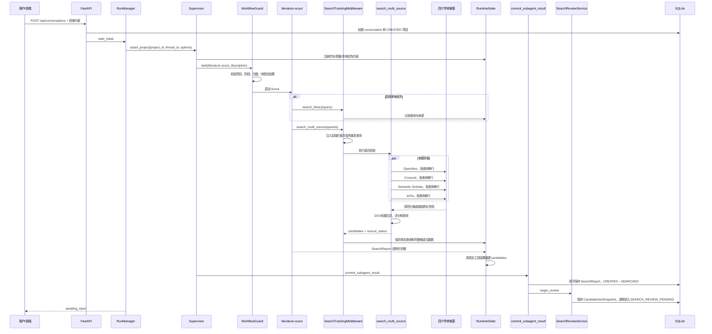

# Research Agent 检索机制完整说明

> 本文以当前工作区源码为准，描述从用户创建研究到候选论文确认的完整检索链路。内容同时区分“模型负责的判断”“工具负责的确定性处理”“应用层负责的业务门禁”，并记录当前实现中的边界行为和已知不一致。

## 1. 范围与结论摘要

项目中的“检索”由两个连续阶段组成：

1. **Agent 自动检索阶段**：Supervisor 委派一次 `literature-scout`。Scout 设计短查询、调用本地库或四源组合检索、做标题摘要级三态筛选，并输出结构化 `SearchReport`。
2. **人工检索审核阶段**：系统把真实工具结果重建成候选集，进入 `SEARCH_REVIEW_PENDING`。用户可以跨页勾选、补充查询、加入 DOI、排除论文、撤销操作，最后确认 `ScreeningDecision`。

核心原则如下：

- Supervisor 本身没有学术检索工具权限，外部初检只能由 `literature-scout` 发起。
- Scout 只决定查询、论文 ID、三态结论和理由；论文完整元数据由中间件从工具真实返回中捕获并重建。
- 四个外部来源为 OpenAlex、Crossref、Semantic Scholar 和 arXiv。
- 多源结果按 DOI 优先、规范化标题兜底进行合并。
- 候选排序综合相关性、论文影响程度、场馆权威性和候选差异性。
- 缺少某项权威或影响指标时，该项从综合分分母中移除并重新归一化。
- 单一渠道论文可以获得高影响分；渠道数量主要影响“影响数据置信度”。
- Agent 初筛不能代替用户确认。只有用户提交 `action=accept` 后才能进入 `SCREENED`。
- 初检部分来源失败、空候选或结构化输出失败时，系统尽量保存已有真实结果并停在可恢复状态。

## 2. 关键代码地图

| 层次 | 文件 | 主要职责 |
| --- | --- | --- |
| API/前端 | `src/research_agent/api/app.py` | 创建研究、获取候选、更新选择、提交反馈、撤销反馈 |
| 后台运行 | `src/research_agent/api/background_runs.py` | 启动独立后台任务，记录运行状态，遇到候选审核时标记 `awaiting_input` |
| 请求模型 | `src/research_agent/api/schemas.py` | API 请求 Schema |
| 页面交互 | `src/research_agent/api/frontend/app.js` | 创建研究、候选分页、勾选、补充检索、确认、候选卡展示 |
| Supervisor | `src/research_agent/agents/supervisor.py` | 建图、构造用户提示、注册约束、启动/恢复运行 |
| Agent 提示词 | `src/research_agent/agents/prompts.py` | Supervisor 与 Scout 的静态 system prompt |
| 子 Agent 注册 | `src/research_agent/agents/registry.py` | Scout 工具白名单、结构化输出、调用次数中间件 |
| 工作流门禁 | `src/research_agent/agents/workflow_guard.py` | 限制阶段、委派次数、待提交结果和人工审核边界 |
| 运行时捕获 | `src/research_agent/agents/runtime_state.py` | 记录真实查询和原始结果，阻止重复查询，重建 Scout 输出 |
| 串行执行 | `src/research_agent/agents/serial_tools.py` | 每条 AI 消息只保留第一个工具调用，工具执行加锁 |
| Scout Skill | `src/research_agent/skills/literature-search/SKILL.md` | 查询拆解、初筛、迭代和输出字段规则 |
| 总流程 Skill | `src/research_agent/skills/research-protocol/SKILL.md` | 从创建项目到人工审核的主流程规则 |
| 外部检索工具 | `src/research_agent/tools/literature_tools.py` | 四源 API、重试、过滤、多源合并、排序 |
| 本地库工具 | `src/research_agent/tools/library_tools.py` | 暴露 `search_library` 等只读工具 |
| 本地库实现 | `src/research_agent/application/library_service.py` | 本地元数据、摘要、笔记、PDF 分块和历史 Evidence 检索 |
| 候选排序 | `src/research_agent/application/candidate_ranking.py` | 相关性、影响、权威性、差异性、撤稿降级 |
| 人工审核 | `src/research_agent/application/search_review.py` | 候选快照、补检、DOI 加入、选择持久化、确认和撤销 |
| 业务校验 | `src/research_agent/application/research_service.py` | Pydantic 校验、候选集门禁、原子保存和状态变化 |
| 字段兼容 | `src/research_agent/application/artifact_normalization.py` | 修复已知字段别名，再交给严格 Schema 校验 |
| ID 规范化 | `src/research_agent/application/paper_ids.py` | 统一 OpenAlex URL、裸 ID 和 DOI 等标识形式 |
| 场馆评级 | `src/research_agent/infrastructure/venue_rankings.py` | SQLite 评级索引、别名匹配、候选场馆信息补全 |
| 配置 | `src/research_agent/infrastructure/config.py` | 检索次数、HTTP 重试、审核轮次、精读容量等环境变量 |
| 持久化 | `src/research_agent/infrastructure/sqlite_repository.py` | 项目、产物、状态事件和逐篇选择状态 |
| 可观测性 | `src/research_agent/infrastructure/run_logger.py` | 工具请求、检索轮次、来源结果、失败和汇总事件 |

## 3. 状态机中的检索位置

检索相关的核心状态为：

```text
CREATED
  └─ literature-scout + SearchReport
       ↓
SEARCHED
  └─ SearchReviewService.begin_review + CandidateSetSnapshot
       ↓
SEARCH_REVIEW_PENDING
  ├─ refine → 仍为 SEARCH_REVIEW_PENDING
  ├─ accept → ScreeningDecision → SCREENED
  └─ stop   → InsufficientEvidence → INCONCLUSIVE
```

状态定义在 `domain/models.py::ResearchStage`，允许转换定义在 `domain/workflow.py::ALLOWED_TRANSITIONS`。

### 3.1 为什么同时存在 SEARCHED 和 SEARCH_REVIEW_PENDING

- `SEARCHED` 表示已经保存并校验了 `SearchReport`。
- `SEARCH_REVIEW_PENDING` 表示应用层已经基于检索约束构建了可供用户操作的 `CandidateSetSnapshot`。
- 两步分开后，系统可以明确区分“搜索报告保存成功”和“候选审核界面准备完成”。

### 3.2 全部结果被年份过滤时的特殊状态

若 `SearchReport.candidates` 非空，但所有论文都因年份限制进入 `filtered_candidates`：

- 系统保存 `CandidateSetSnapshot`；
- 项目暂时保留在 `SEARCHED`；
- `blocked_reason` 提示用户手动恢复；
- 用户加入论文或补充检索后，系统再转入 `SEARCH_REVIEW_PENDING`。

若原始 `SearchReport.candidates` 本身为空，系统仍进入 `SEARCH_REVIEW_PENDING`，允许用户补充查询或 DOI。

## 4. 用户入口与参数流

### 4.1 当前前端主入口

前端 `startResearch()` 调用：

```http
POST /api/conversations
Content-Type: application/json
```

请求核心字段：

```json
{
  "topic": "研究主题",
  "research_question": "研究问题",
  "max_search_rounds": 3,
  "year_from": 2024,
  "year_to": 2026,
  "prefer_library_search": false
}
```

API 先调用 `ResearchService.create_conversation()`，同步创建 conversation 和 `CREATED` 项目，再由 `ConversationRunManager.start_initial()` 启动后台任务。后台最终调用：

```python
ResearchSupervisor.astart_project(project_id, thread_id, **options)
```

因此当前页面常规路径使用的是“项目已预创建”的 Supervisor 提示，而非要求模型创建项目的旧式路径。

### 4.2 兼容入口

项目仍保留：

- `POST /api/research/invoke`：同步等待完整 Agent 本轮结果；
- `POST /api/research/stream`：通过 SSE 返回运行更新；
- CLI/Python 的 `invoke`、`ainvoke`、`astream`。

这些入口可以让 Supervisor 自己调用 `create_research_project`。

### 4.3 检索约束

`SearchConstraints` 当前字段为：

| 参数 | 默认值 | Schema 限制 | 实际作用 |
| --- | ---: | --- | --- |
| `year_from` | 2024 | 2000–2026 | 注入工具参数，并在来源适配器和审核层再次过滤 |
| `year_to` | 2026 | 2000–2026 | 同上 |
| `prefer_library_search` | false | bool | 控制 Scout 是否必须先检索本地库 |
| `max_search_rounds` | 可空 | 1–10 | Agent 检索词设计轮数上限；首次多源检索计为第 1 轮 |
| `min_papers` | 可空 | ≥1 | 为 API 兼容保留，运行时固定为 1 |
| `max_papers` | 可空 | ≥1 | 为 API 兼容保留，运行时由后端精读容量覆盖 |

`ResearchSupervisor._search_review_options()` 会丢弃客户端提交的 `min_papers/max_papers`，固定使用：

```text
min_papers = 1
max_papers = RESEARCH_AGENT_MAX_DEEP_READ_PAPERS（默认 8）
```

这意味着用户决定论文相关性，系统决定本轮最多精读多少篇。

## 5. Prompt 的完整构造方式

检索过程至少包含四层上下文：Supervisor system prompt、Supervisor user prompt、Scout system prompt、Supervisor 动态生成的 Scout task description。

### 5.1 Supervisor system prompt

构造位置：

```python
inject_skill(PI_PROMPT, "research-protocol", research_protocol_skill_content)
```

最终结构近似：

```text
[PI_PROMPT 静态规则]

## 已注入的 research-protocol Skill
以下 Skill 全文已经由程序在启动时加载……
<skill name="research-protocol">
  [skills/research-protocol/SKILL.md 全文]
</skill>
```

与检索直接相关的 Supervisor 规则包括：

- 新任务先创建项目；预创建项目禁止再次创建。
- 正常只委派一次 `literature-scout`。
- Scout 必须接收主题、研究问题、精读容量和检索轮次限制。
- Supervisor 不能直接调用外部搜索工具。
- Scout 输出后必须调用 `commit_subagent_result`，禁止手工复制 JSON。
- `SearchReport.search_terms` 以系统捕获的真实执行记录为准。
- 空候选也要保存并进入人工审核。
- 进入 `SEARCH_REVIEW_PENDING` 后立即结束本轮 Agent 执行。
- `ScreeningDecision` 只能由人工审核 API 确认。

### 5.2 Supervisor user prompt

普通入口由 `build_prompt()` 生成。预创建项目入口由 `build_existing_project_prompt()` 在外层补充项目 ID 和阶段门禁。

典型结果结构：

```text
系统已经为当前隔离对话创建科研项目：RP-...
禁止再次调用create_research_project……
当前项目处于CREATED阶段，请直接委派literature-scout……

研究主题：...
研究问题：...

本次研究的检索约束与系统容量：
- 论文发表年份：2024-2026（后端强制过滤）
- 系统单次精读容量：最多 8 篇；至少选择 1 篇
- 系统检索-筛选迭代轮数上限：3
- 出版物质量：...（仅启用时出现）
- 文献库优先检索：启用/未启用
委派 literature-scout 时必须把这些限制传入任务描述……

请按证据驱动科研流程执行。
```

### 5.3 Scout system prompt

构造位置：`agents/registry.py::build_subagent_registry()`。

最终组成：

```text
[SCOUT_PROMPT]

## 本次任务的真实工具预算
[动态预算文字]

## 已注入的 literature-search Skill
<skill name="literature-search">
  [skills/literature-search/SKILL.md 全文]
</skill>
```

`SCOUT_PROMPT` 规定：

1. 把长问题拆成 2–5 条可独立命中的英文短查询。
2. 查询分别覆盖核心任务、关键方法、数据集/基准和评价方向。
3. 年份和场馆条件通过工具参数传入，不塞进查询字符串。
4. 启用本地优先时先查 `search_library`，未启用时禁止查本地库。
5. 外部检索调用 `search_multi_source(queries=[...])`。
6. 使用标题、摘要、`sources`、`matched_queries` 和排序分数做 include/exclude/uncertain 初筛。
7. 来源失败时保留其他结果。
8. 只有存在明确 coverage gap 时再调用一次互补查询组合。
9. 每篇候选必须输出一句简短中文筛选依据，不摘录摘要，建议不超过 40 个汉字。
10. 不输出完整候选元数据，只输出 ID、筛选结论和分析字段。

### 5.4 Scout task description

task description 没有独立的固定 Python 模板。Supervisor 模型依据 system prompt 和 user prompt 动态构造，再调用 Deep Agents 的 `task` 工具：

```json
{
  "subagent_type": "literature-scout",
  "description": "包含主题、研究问题、年份、场馆限制、本地优先设置、精读容量和迭代上限的任务说明"
}
```

工作流中间件只检查 `subagent_type`、阶段、次数和待提交结果，并不会逐字段解析 Scout description 是否完整。因此任务描述完整性主要依赖 Supervisor prompt。

### 5.5 共享记忆注入

`recording_runnable()` 会在子 Agent 消息前插入一条系统消息，其中包含 `ResearchService.build_agent_memory()` 生成的共享记忆账本。对第一次 Scout 调用而言，项目通常只有基础项目信息，尚无检索产物。账本要求 ID 和已提交产物保持原样。

### 5.6 结构化输出方式

Scout 通过 `create_agent(..., response_format=...)` 绑定 `SearchReport`：

- Anthropic 原生模型：强制使用 LangChain `ToolStrategy(SearchReport)`；
- 其他模型：传入 `SearchReport.model_json_schema()`。

若模型没有产生 `structured_response`，运行时会依次尝试：

1. 从期望的 Schema 工具调用参数中恢复；
2. 从 AI 文本中的纯 JSON 对象恢复；
3. 仍失败则记录 `_subagent_error=structured_response_missing` 和脱敏诊断。

## 6. Agent 权限和硬门禁

### 6.1 Supervisor 工具隔离

`ResearchSupervisor._build_graph()` 把以下检索工具从 Supervisor 工具列表中隐藏：

```text
search_library
search_openalex
search_crossref
search_semantic_scholar
search_arxiv
search_multi_source
verify_doi
```

初检阶段 Supervisor 只能委派 Scout，然后提交 Scout 结果。

### 6.2 Scout 实际工具白名单

Scout 当前仅获得两个工具：

```text
search_library
search_multi_source
```

Scout 无法直接调用 `search_openalex`、`search_crossref`、`search_semantic_scholar` 或 `search_arxiv`。四源调用发生在 `search_multi_source` 内部。

### 6.3 串行工具调用

`SerialToolExecutionMiddleware` 同时提供两层保证：

- 模型一条消息若生成多个工具调用，只保留第一个；
- 同一 Agent 的同步/异步工具执行通过锁串行化。

Scout 的多个来源请求虽然在 `search_multi_source` 内部并发，但对 Agent 来说仍是一次工具调用。

### 6.4 模型和工具调用上限

Scout 中间件当前配置：

```text
ModelCallLimit = 16
search_library 最多 2 次
search_multi_source 最多执行用户创建研究时设置的 n 轮（1–10）
```

每次 `search_multi_source` 调用算一轮，一轮可包含多条互补检索词。运行时中间件负责硬计数，达到 n 后要求 Scout 使用已有结果提交报告。

### 6.5 阶段和委派次数门禁

`ResearchWorkflowGuardMiddleware` 要求：

- `literature-scout` 只能在 `CREATED` 阶段委派；
- 当前线程必须已经绑定项目；
- 上一个 Scout 结果必须先提交；
- 正常只允许一次 Scout 委派；
- 首次提交结构无效且 `rejection_count == 1` 时允许一次纠正性重试；
- 两次无效后停止重试并记录可恢复问题。

## 7. 初次检索的完整时序



## 8. 查询记录、约束注入和重复查询拦截

`ExecutedSearchTrackingMiddleware` 在工具执行前执行 `_reserve()`。

### 8.1 本地优先控制

- `prefer_library_search=false` 时，调用 `search_library` 会返回 `local_library_search_disabled`。
- `prefer_library_search=true` 且尚未调用本地库时，外部检索会返回 `local_library_search_required`。
- 本地库已经查过且返回 0 条后，再次调用本地库会被阻止。

### 8.2 强制注入后端约束

模型传给外部检索工具的参数会被中间件更新：

```python
args.update({
    "year_from": ...,
    "year_to": ...,
})
```

因此模型无法通过遗漏或修改这些字段绕过用户/后端约束。

### 8.3 查询去重

查询意图键的计算方式：

1. Unicode 单词分词；
2. 小写化；
3. 长度大于 3 且以 `s` 结尾时去掉末尾 `s`；
4. 使用集合去掉重复 token；
5. token 排序后拼接。

例如仅改变词序或简单复数形式，通常会得到相同键。重复查询返回结构化错误 `duplicate_search_query`。

`search_multi_source` 中每条 query 单独登记。若一组查询中只有部分是新的，中间件会直接把参数中的 `queries` 改成剩余的新查询。

### 8.4 真实执行记录覆盖模型输出

Scout 完成后，`recording_runnable()` 强制执行：

```python
payload["search_terms"] = runtime_state.search_terms(thread_id)
```

若 `query` 为空，则使用真实查询以 ` | ` 拼接。模型无法在最终 `SearchReport` 中补写未执行查询。

## 9. 本地文献库检索

### 9.1 数据范围

`search_library` 可以利用：

- 论文题名、作者、摘要、DOI、标签；
- 用户笔记；
- 已生成的 PaperAnalysis/PaperCard；
- 历史项目 Evidence；
- 已索引 PDF 的分页文本块。

### 9.2 查询分词

- 英文/数字 token：`[a-z0-9][a-z0-9_+.-]*`；
- 中文连续片段：至少 2 个汉字；
- 四字及以上中文片段额外生成二元汉字片段；
- 去除 `QUERY_STOP_WORDS`。

### 9.3 文本评分

对每个查询词：

```text
词项分 = min(出现次数, 5) × max(1, min(词长, 8) / 2)
```

论文元数据得分乘以 2，再加上该论文最相关的 3 个来源片段得分。最终按得分降序、标题稳定排序，返回最多 20 篇。

### 9.4 本地结果字段

本地候选包含 `library_id`。后续用户确认后，Reader 会优先复用本地索引，而不重新联网获取同一论文。

## 10. 四个外部来源适配器

所有来源先把 `limit` 裁剪到 1–20，再通过 `prepare_candidates()` 统一执行年份校验和场馆评级补全。场馆评级只参与排序与展示，不执行硬过滤。

### 10.1 OpenAlex

请求：`GET https://api.openalex.org/works`。

主要参数：

- `search=query`；
- `per-page`：等于 limit；
- `filter=from_publication_date...,to_publication_date...`；
- 可选 `api_key` 和 `mailto`；
- `select` 仅请求需要字段。

提取字段包括：

- OpenAlex work ID、题名、作者、年份、DOI；
- 最佳开放 PDF/落地页；
- 倒排索引还原的摘要；
- 发表场馆、文献类型和主学科；
- `cited_by_count`；
- `citation_normalized_percentile.value`；
- `fwci`；
- `counts_by_year` 推导的近期引用速度；
- `is_retracted`。

### 10.2 Crossref

请求：`GET https://api.crossref.org/works`。

主要参数：`query`、`rows`、发表日期 filter、可选 `mailto`。

提取字段包括：DOI、题名、作者、日期、HTML 摘要清洗结果、容器名称、类型、学科、`is-referenced-by-count` 和 retraction update。

### 10.3 Semantic Scholar

请求：`GET https://api.semanticscholar.org/graph/v1/paper/search`。

提取：

- Semantic Scholar ID、DOI、arXiv ID；
- 题名、作者、年份、摘要、场馆、类型、学科；
- 开放 PDF；
- `citationCount`；
- `influentialCitationCount`。

论文主 ID 优先级为：

```text
DOI → arXiv:<id> → S2:<paperId>
```

### 10.4 arXiv

请求：`GET https://export.arxiv.org/api/query`，使用 Atom XML。

参数包括 `all:<query>`、`sortBy=relevance`、`sortOrder=descending`。提取题名、作者、年份、摘要、分类和 PDF URL，并构造：

```text
paper_id = arXiv:<id>
doi      = 10.48550/arXiv.<id>
type     = preprint
```

## 11. HTTP 重试与来源失败

默认策略：

```text
max_retries = 3
backoff_seconds = 1.0
max_retry_wait_seconds = 30.0
timeout = 20 秒
```

### 11.1 可重试错误

- HTTP 429；
- HTTP 5xx；
- `URLError`；
- Timeout（最多额外重试一次）。

退避为 `backoff_seconds × 2^attempt`，若响应提供 `Retry-After` 则优先采用。建议等待时间超过 `max_retry_wait_seconds` 时直接返回失败。

### 11.2 不重试或有限重试错误

- 非 429 的 4xx；
- 无效 JSON/XML；
- UTF-8 解码失败。

### 11.3 结构化失败返回

来源适配器不会把常见学术 API 错误直接抛给 Agent，而会返回：

```json
{
  "ok": false,
  "source": "OpenAlex",
  "error_code": "rate_limited",
  "status_code": 429,
  "attempts": 4,
  "retryable": true,
  "instruction": "保留已有搜索结果并继续生成 SearchReport，不要重复相同查询。"
}
```

## 12. `search_multi_source` 的内部执行逻辑

### 12.1 输入清洗

- 去除首尾和重复空格；
- 按大小写不敏感的完整字符串去重；
- 最多保留 6 条查询；
- `limit_per_source` 限制为 1–10；
- 空 queries 返回带错误字段的结构化对象。

### 12.2 并发模型

使用四线程池：四个来源并行，每个来源内部按查询顺序串行。

```text
OpenAlex:          q1 → q2 → q3
Crossref:          q1 → q2 → q3
Semantic Scholar:  q1 → q2 → q3
arXiv:             q1 → q2 → q3
```

这降低跨来源等待时间，同时避免对同一 API 瞬间并发多个请求。

### 12.3 来源失败隔离

某来源对一条查询失败时，仅记录该“查询×来源”的失败状态；同一来源仍会继续尝试本轮后续查询，其他来源也继续运行。

若来源工具抛出未预期异常，组合工具额外尝试调用一次；第二次仍失败则记录 `source_exception`。

### 12.4 `source_status`

每个“查询×来源”都会记录成功数量或失败详情。该字段用于：

- Scout 的 `selection_notes`；
- 人工补充检索的 `search_failures`；
- 运行日志和前端进度事件。

## 13. 多源合并和去重

### 13.1 合并键

优先使用规范化 DOI：

```text
doi:<lowercase DOI without https://doi.org/>
```

DOI 缺失时使用规范化标题：小写、非单词字符替换为空格、压缩空白。

空 DOI 和空标题候选被忽略。

### 13.2 字段合并策略

同一论文再次命中时：

- `sources` 去重追加；
- `matched_queries` 去重追加；
- 标量元数据只在当前值为空时补充；
- 摘要保留更长版本；
- 作者和学科去重合并；
- 各来源引用指标按来源 key 合并；
- `is_retracted` 使用逻辑或；
- 展示 `source` 变为 `OpenAlex + Crossref + ...`。

原始引用数不会跨渠道相加。

## 14. 场馆评级补全

### 14.1 本地评级索引

`VenueRankingIndex` 在 SQLite 中维护：

- `venue_rankings`；
- `venue_aliases`；
- 可用时启用 FTS5 `venue_rankings_fts`。

启动时从 `data/venue_rankings.json` 幂等导入种子数据。

### 14.2 匹配顺序

1. 规范化别名精确匹配，置信度 1.0；
2. FTS5 召回最多 20 条；
3. FTS 不可用或无结果时 LIKE 召回；
4. 用包含关系和 `SequenceMatcher` 重排；
5. 最佳分低于 0.82 时视为未可靠命中。

若来源给出 venue type，匹配候选还会按 journal/conference 限制。

### 14.3 补全字段

可靠命中时添加 CCF、JCR、影响因子、Nature Portfolio、来源 URL、来源标签和匹配置信度。未命中时明确写入“未可靠命中”，不猜测等级。

场馆评级只用于候选排序、解释和页面展示。CCF/JCR 数据缺失不会导致论文从候选集中删除。

## 15. 候选排序机制

实现入口：`rank_candidates(candidates, queries, decisions=None)`。

### 15.1 综合分

```text
综合分 = 55% × 相关性
       + 30% × 论文影响程度
       + 10% × 场馆权威性
       +  5% × 候选差异性
```

某项缺失时从分母中移除该项，对可用项重新归一化。相关性总会得到数值，因此综合分有稳定兜底。

### 15.2 相关性

对每条查询：

```text
单查询分 = 70% × 标题 token 覆盖率
         + 30% × 摘要 token 覆盖率

总相关性 = 100 × (70% × 最佳单查询分 + 30% × 所有查询平均分)
```

token 长度必须大于 1。空查询时复用候选已有的 `relevance_score`，并裁剪至 0–100。

### 15.3 引用百分位的候选集合

只有原始引用数而没有原生百分位时，系统依次寻找比较集合：

1. 同学科、同年份、同文献类型，至少 5 条；
2. 同学科、年份 ±1、同类型，至少 5 条；
3. 同学科、任意年份、同类型，至少 5 条；
4. 不限学科、年份 ±1、同类型，至少 5 条；
5. 不限学科和年份、同类型，至少 2 条；
6. 仍不足则使用全部有值候选。

经验百分位采用中位秩：

```text
(小于当前值的数量 + 0.5 × 等于当前值的数量) / 总数
```

只有一个值时使用保守饱和函数：

```text
1 - exp(-value / 20)
```

### 15.4 论文影响程度

论文影响程度内部为：

```text
影响程度 = (65% × P + 20% × Q + 15% × M) / 可用分项权重
```

- `P`：多来源引用百分位；
- `Q`：Semantic Scholar 高价值引用百分位；
- `M`：近期引用增长百分位。

引用百分位融合：

```text
P = OpenAlex 50% + Semantic Scholar 35% + Crossref 15%
```

近期增长融合：

```text
M = OpenAlex 60% + Semantic Scholar 30% + Crossref 10%
```

仅对可用来源重加权。arXiv 当前不提供论文级引用指标，不进入影响计算。

### 15.5 近期引用速度

OpenAlex 的 `counts_by_year` 只取当前年份之前的两个完整年度，计算平均 `cited_by_count`。无对应年度则缺失。

### 15.6 影响数据置信度

```text
影响置信度 = 55% × 引用来源权重覆盖
           + 25% × 影响分项覆盖
           + 20% × 来源一致性
```

只有一个来源百分位时，一致性取 0.5。两个以上来源时，最大差距越大，一致性越低；差距达到 50 个百分点时降至 0。

影响置信度不进入综合分，所以 OpenAlex 单渠道的高影响论文不会因缺少其他渠道而被降低影响分。

### 15.7 场馆权威性

```text
CCF-A/B/C = 100/75/55
JCR Q1/Q2/Q3/Q4 = 90/70/50/30
Nature Portfolio = 95
```

同一场馆命中多个体系时，权威分取最高值，解释中保留全部标签。影响因子只展示，不直接进入权威分。

### 15.8 候选差异性

使用贪心 MMR 风格重排：

```text
差异性 = 100 × (1 - 与已排序候选的最大 Jaccard 相似度)
```

相似度 token 来自题名、最多 1000 字摘要、场馆和学科。首篇差异性为 100；文本为空时取 50。

### 15.9 Agent 决策优先级

排序首先按三态分组：

```text
include → uncertain → exclude
```

组内再按综合分、相关性、影响分、年份和标题排序。因此一个低分 include 仍排在高分 uncertain 之前。

### 15.10 撤稿

撤稿论文保留原始影响分，但综合分上限为 5，前端显示“撤稿风险”。

### 15.11 极端值处理

- 非数字、NaN、无穷值视为缺失；
- 百分位兼容 0–1 和 0–100；
- 负引用数裁剪为 0；
- 得分裁剪到合法范围；
- 空候选直接返回空列表；
- 同分按稳定字段排序，确保分页可复现。

## 16. Scout 输出如何被系统重建

### 16.1 Scout 真正需要输出的字段

```json
{
  "query": "总体主题",
  "candidate_ids": ["真实 paper_id 或 DOI"],
  "screening_decisions": {"paper_id": "include|exclude|uncertain"},
  "screening_reasons": {"paper_id": "简短中文理由"},
  "coverage_gaps": [],
  "search_iteration_log": [],
  "selection_notes": []
}
```

`search_terms` 和 `candidates` 由系统校正或重建。

### 16.2 原始结果捕获

每次 `search_library` 或 `search_multi_source` 成功返回字符串后，中间件解析 JSON：

- 字典结果取 `candidates`；
- 列表结果直接视为候选；
- 复制标准元数据、来源、查询轨迹、影响指标和场馆评级字段；
- 存入线程内的 `_raw_search_results`。

该运行时仓库位于内存，只负责当前 Agent 调用交接；提交后的 `SearchReport` 会进入 SQLite。

### 16.3 再次去重

Scout 结束时，运行时对跨多次工具调用的结果再次去重：

- 标识优先使用规范化 paper ID/DOI；
- 无标识时使用小写标题；
- 列表字段合并；
- 字典指标按来源合并；
- 摘要保留更长值；
- 撤稿标志使用逻辑或。

### 16.4 用 candidate_ids 选择真实记录

运行时把 Scout 的 `candidate_ids` 规范化，再从真实工具结果中匹配：

- 匹配成功：只用匹配记录构造 `candidates`，写入 Agent 三态后重新排序；
- Scout 错用 P001/P002 等临时 ID：按真实结果顺序映射，并同步改写决策和理由字典；
- 有真实结果但正常匹配失败：保留全部真实结果重新排序，避免模型格式问题导致结果丢失。

### 16.5 字段兼容层

提交前 `normalize_artifact_payload()` 兼容有限别名：

- `research_question → query`；
- `papers → candidates`；
- `screening → screening_decisions`；
- `exclusion_reasons → screening_reasons`；
- `search_log → search_iteration_log`；
- `summary → selection_notes`。

兼容后仍由 Pydantic `SearchReport` 严格校验。

## 17. 中文筛选依据

### 17.1 Agent 生成要求

- 每篇进入审核列表的论文必须有一句中文理由；
- include 说明与研究问题的直接关系；
- uncertain 说明缺少的信息；
- exclude 说明具体偏离原因；
- 不复述英文摘要；
- 不添加“筛选依据”等前缀；
- 建议不超过 40 个汉字。

### 17.2 应用层兜底

`SearchReviewService` 对理由进行：

1. 合并多余空白；
2. 移除“筛选依据/筛选理由/文章核心内容/核心内容”前缀；
3. 检查是否包含中文；
4. 取第一个句子；
5. 最长 64 个字符，超出截断；
6. 自动补句末标点。

若理由缺失或完全为英文，按状态生成：

- include：`论文主题与研究问题直接相关，建议纳入后续精读。`
- exclude：`论文主题与当前研究问题关联较弱，建议排除。`
- uncertain：`标题和摘要信息不足，暂时无法确定相关性，建议人工判断。`

该转换在 API 生成候选预览时也会执行，所以旧项目中的英文理由无需重新检索。

## 18. SearchReport 提交和初始候选快照

Supervisor 调用：

```text
commit_subagent_result(project_id, "literature-scout")
```

工具从 `ResearchRuntimeState` 读取最新未消费结构化结果，依次执行：

1. 校验当前线程绑定的 project ID；
2. 校验存在待提交 Scout 结果；
3. 保存 `SearchReport` 并原子执行 `CREATED → SEARCHED`；
4. 调用回调 `SearchReviewService.begin_review()`；
5. 再次执行场馆补全和年份过滤；
6. 构造并保存 `CandidateSetSnapshot`；
7. 初始化逐篇选择表；
8. 通常执行 `SEARCHED → SEARCH_REVIEW_PENDING`；
9. 标记运行时 Scout 结果已消费。

## 19. 人工候选审核

### 19.1 获取候选

```http
GET /api/projects/{project_id}/search-review?page=1&page_size=20&q=&filtered_page=1
```

服务端分页大小限制为 1–50。候选搜索字段包括 paper ID、DOI、题名、场馆、场馆缩写、CCF/JCR 标签和作者；当前不搜索摘要正文。

API 为减少载荷把摘要截到 700 字，并返回 `abstract_truncated`。

### 19.2 默认选择

默认优先级：

1. 已持久化的 `search_review_selections`；
2. 快照的 `selected_paper_ids`；
3. Agent 的 include 列表；
4. 若以上均为空，则默认选择全部候选。

### 19.3 跨页选择

```http
PATCH /api/projects/{project_id}/search-review/selection
```

```json
{
  "paper_ids": ["W..."],
  "selected": false
}
```

选择状态存入独立 SQLite 表 `search_review_selections`，所以翻页和刷新不会丢失。

### 19.4 候选卡呈现

每张卡当前展示：

- 题名、作者、年份、来源；
- Agent 三态标签；
- 综合、影响、相关、场馆分数；
- 场馆评级及其数据来源；
- 一句中文“筛选依据”；
- 摘要；
- DOI、原文链接和收藏按钮。

## 20. 人工补充检索与候选变更

提交入口：

```http
POST /api/projects/{project_id}/search-feedback
```

### 20.1 refine

支持同时：

- 提交补充查询 `suggested_queries`；
- 加入 DOI 或手工论文；
- 结合已经持久化的勾选状态排除论文。

每轮最多接受 `RESEARCH_AGENT_MAX_SUGGESTED_QUERIES_PER_ROUND` 条查询，默认 3。查询使用与运行时相同的 token 集合键去重。人工补检采用独立计数，不占用 Agent 的 `max_search_rounds`。

补检由 `SearchReviewService` 直接调用 `search_multi_source`，不再委派 Scout，也不调用 LLM。失败来源写入 `search_failures`，新增候选写入 `SupplementalSearchReport`。

### 20.2 手工 DOI

有 DOI 时调用 `verify_doi` 通过 Crossref 获取可信元数据。验证失败会拒绝加入。

仅提供 `paper_id + title` 时允许加入，但：

- source 标记为 `user-unverified`；
- 用户填写的 abstract 被清空；
- 防止未经验证的自由文本成为后续证据。

### 20.3 合并和排除

- 显式排除 ID 加入 `excluded_paper_ids`；
- 当前取消勾选的论文也进入排除集合；
- 新检索/手工加入项从排除集合移除并默认选中；
- 合并键依次为 DOI、规范化 paper ID、标题。

### 20.4 accept

确认时要求：

- 候选集非空；
- 篇数至少 1；
- 篇数不超过后端精读容量，默认 8。

确认后保存：

```json
{
  "included_paper_ids": ["当前剩余候选的全部 ID"],
  "excluded_paper_ids": ["累计排除 ID"],
  "reasons": ["用户确认最终候选集，共N篇；系统自动检索R轮。"]
}
```

随后原子进入 `SCREENED`。对于对话项目，API 会立即创建后续研究任务，Reader 只处理 `included_paper_ids`，页面不再显示单独的“继续研究”确认步骤。

### 20.5 stop

保存 `InsufficientEvidence` 并进入 `INCONCLUSIVE`，其中保留已尝试查询和失败记录。

### 20.6 undo

撤销采用追加补偿方式：

- 保存一条 `SearchFeedback(action=undo)`；
- 复制倒数第二版 `CandidateSetSnapshot` 作为新版本；
- 重建选择表；
- 必要时把 SCREENED/INCONCLUSIVE 项目重新打开到 `SEARCH_REVIEW_PENDING`；
- 有活动 continuation run 时禁止撤销。

## 21. 数据持久化和可追踪性

### 21.1 Append-only 产物

检索阶段主要保存：

```text
SearchReport
CandidateSetSnapshot（可多版）
SearchFeedback（可多条）
SupplementalSearchReport（补检时）
ScreeningDecision 或 InsufficientEvidence
```

`artifacts` 表保留每一版 JSON。状态变化另写入 `state_events`，包含 from/to stage、actor、时间和产物哈希。

### 21.2 可变选择表

逐篇勾选状态单独存入 `search_review_selections(project_id, paper_id, selected, updated_at)`。它是审核 UI 的即时状态，不代替版本化候选快照。

### 21.3 线程内运行时状态

以下内容只在当前进程内保存，提交时才转为持久化产物：

- 线程与项目映射；
- 真实查询序列和去重键；
- 已调用来源；
- 原始工具候选；
- 待提交子 Agent 结果；
- 子 Agent 拒绝计数。

LangGraph checkpointer 当前为 `InMemorySaver`。跨进程恢复依赖 SQLite 产物和应用层 continuation context，不依赖旧的运行时内存。

## 22. 可观测性

`ResearchRunLogger` 记录：

- `tool.request`：工具名和输入；
- `search.started`：组合检索轮次、查询和四个来源；
- `search.results`：去重候选数、候选详情和 `source_status`；
- `search.rate_limited/search.failed`：错误码、尝试次数和 HTTP 状态；
- `search.summary`：SearchReport 的轮数、候选数、查询、覆盖盲区；
- LLM 请求、响应和 token/元数据；
- Agent 委派和产物提交。

后台运行管理器最多在内存中保留每个 run 最近 120 条进度事件，前端轮询展示。

## 23. 失败和极端情况兜底

| 情况 | 当前处理 |
| --- | --- |
| 单个来源 429/5xx | 指数退避；最终失败写入 `source_status`，保留其他来源 |
| 来源返回无效 JSON/XML | 标记 `invalid_response`，同一来源仍继续尝试后续查询 |
| 全部外部来源失败 | 返回空 candidates 和完整状态；Scout仍应提交 SearchReport |
| Scout 输出缺少结构化对象 | 尝试从工具调用或 JSON 文本恢复；失败则生成 `_subagent_error` |
| Scout 首次结构无效 | 提交工具消费旧结果，允许一次纠正重试 |
| Scout 两次无效 | 停止重试，保存 `RuntimeIssue`，保持当前阶段 |
| Scout 使用临时 P001 ID | 运行时按真实结果顺序映射为真实 ID |
| Scout ID 与工具结果不匹配 | 保留全部真实工具结果，避免候选丢失 |
| 候选年份缺失且启用年份约束 | 进入硬过滤区 |
| 场馆评级缺失 | 权威分缺失，综合分对其他项重加权 |
| 只有 OpenAlex 影响指标 | 正常计算影响分，置信度下降 |
| 引用极端值 | 先转百分位，非有限值忽略，负数归零 |
| 撤稿论文 | 影响分保留，综合分上限 5 |
| 候选为空 | 保存空报告和快照，等待用户补检/加入 DOI |
| 所有候选被年份过滤 | 保持 SEARCHED 并开放手动恢复 |
| 用户接受空集合 | 拒绝 |
| 用户接受超过精读容量 | 拒绝 |
| 手工 DOI 无法验证 | 拒绝加入 |
| 跨页选择 | SQLite 即时持久化 |
| 撤销时后续运行活跃 | 拒绝撤销，防止状态竞态 |

## 24. 当前实现中需要特别注意的细节

以下条目描述当前代码现状，便于后续维护时区分设计目标和真实行为。

### 24.1 Scout 的 `candidate_ids` 语义偏向保留项

Prompt 要求 `candidate_ids` 包含 include + uncertain。运行时匹配成功时只把这些 ID 对应的真实论文写入最终 candidates。因此被 Scout 判为 exclude 且未写入 `candidate_ids` 的论文不会进入普通审核候选区。

若希望用户也能复核全部 Agent exclude，后续需要明确扩展 `candidate_ids` 语义或单独保存排除候选。

### 24.2 工具层首次排序时没有 Agent 三态

`search_multi_source` 在 Scout 做判断之前先排序，此时所有论文使用默认决策优先级。Scout 返回后，运行时给匹配候选补上 `agent_decision` 并再次排序，第二次排序才应用 include/uncertain/exclude 分组。

### 24.3 人工补检不经过 Scout 二次筛选

用户在审核页提交补充查询后，`SearchReviewService` 直接调用 `search_multi_source`。新论文没有 LLM 生成的三态和针对性理由，通常由应用层归为 uncertain 并显示中文兜底理由；同时新项会默认选中。

### 24.4 补检后的旧新候选没有全局重新评分

组合工具会对“本轮新增论文”内部排序，但 `_merge_candidates()` 合并旧候选和新增候选后没有再次调用 `rank_candidates`。最终顺序通常为旧候选原顺序加新增候选本轮顺序。

### 24.5 Agent 自动检索与人工补检分别计数

用户创建研究时设置 `max_search_rounds=n`。每次实际执行 `search_multi_source` 算一轮，一轮可包含多条检索词；运行时按线程原子计数并覆盖模型自报日志。达到 n 后拒绝新的 Agent 检索，要求使用已有结果提交 `SearchReport`。

人工筛选阶段的补充查询使用 `manual_search_round` 单独计数，不改变 Agent 的 `search_round/max_search_rounds`。

## 25. 一个端到端示例

假设用户输入：

```text
主题：大模型与小模型协同的 AIOps
问题：不同协同范式如何用于日志异常检测？
年份：2022-2026
本地优先：关闭
质量场馆限定：关闭
```

可能的执行过程：

1. 前端创建 conversation 和 `CREATED` 项目。
2. Supervisor user prompt写入主题、问题、年份、最多 8 篇、轮次上限和“跳过本地库”。
3. Supervisor 委派 Scout。
4. Scout 拆出：
   - `LLM small model collaboration AIOps`
   - `retrieval augmented log anomaly detection`
   - `agent tool augmentation log analysis`
5. Scout 一次调用 `search_multi_source(queries=[...])`。
6. 中间件注入 `year_from=2022, year_to=2026`。
7. 四个来源并行，每个来源依次运行三条查询。
8. 工具把相同 DOI 的记录合并，保留来源和命中查询列表。
9. 工具计算初次相关性、影响、权威和差异性排序。
10. Scout阅读候选标题摘要，输出真实 ID、三态和中文理由。
11. 运行时用真实查询覆盖 `search_terms`，从工具结果匹配 ID，再按三态重新排序。
12. `commit_subagent_result` 保存 `SearchReport`，进入 `SEARCHED`。
13. `begin_review` 再校验年份和场馆，保存 `CandidateSetSnapshot`，进入 `SEARCH_REVIEW_PENDING`。
14. 前端显示候选卡；用户取消不相关论文，补充一条查询并加入 DOI。
15. 审核服务直接调用组合检索，保存 `SupplementalSearchReport` 和新版候选快照。
16. 用户确认，保存 `ScreeningDecision` 并进入 `SCREENED`，API 立即启动后续研究任务。
17. continuation 读取确认后的论文，禁止重新检索。

## 26. 配置项汇总

| 环境变量 | 默认值 | 作用 |
| --- | ---: | --- |
| `RESEARCH_AGENT_MODEL` | `openai:gpt-4.1-mini` | Supervisor/Scout 使用的模型 |
| `RESEARCH_AGENT_PROVIDER` | `auto` | OpenAI/Anthropic/Bedrock 路径 |
| `OPENALEX_API_KEY` | 空 | OpenAlex 配额身份 |
| `OPENALEX_EMAIL` | 空 | OpenAlex/Crossref polite usage |
| `RESEARCH_AGENT_SEARCH_MAX_RETRIES` | 3 | HTTP 最大重试次数 |
| `RESEARCH_AGENT_SEARCH_BACKOFF_SECONDS` | 1.0 | 指数退避基数 |
| `RESEARCH_AGENT_SEARCH_MAX_RETRY_WAIT_SECONDS` | 30.0 | 单次可接受最大等待 |
| `RESEARCH_AGENT_MAX_SEARCH_REVIEW_ROUNDS` | 3 | 默认人工补检轮次上限 |
| `RESEARCH_AGENT_MAX_SUGGESTED_QUERIES_PER_ROUND` | 3 | 每轮用户补充查询上限 |
| `RESEARCH_AGENT_MAX_DEEP_READ_PAPERS` | 8 | 用户最终可确认的最大论文数 |
| `RESEARCH_AGENT_GRAPH_RECURSION_LIMIT` | 512 | LangGraph 运行递归上限 |

## 27. 维护时的推荐检查顺序

修改检索机制时建议按以下顺序核对：

1. `SearchConstraints/SearchReport/CandidateSetSnapshot` 是否需要扩展字段；
2. API 和前端是否透传字段；
3. `build_prompt` 是否准确描述约束；
4. Scout prompt 与 Skill 是否一致；
5. Scout 实际工具白名单和调用上限是否匹配 prompt；
6. 中间件是否强制注入约束并捕获真实结果；
7. 四个来源是否返回统一字段；
8. 合并键和 ID 规范化是否覆盖新来源；
9. 排序缺失值和极端值是否安全；
10. `begin_review` 是否再次执行年份过滤；
11. 补检是否需要全局重排和字段级合并；
12. `ScreeningDecision` 是否只能引用最新候选快照；
13. SQLite、运行日志和测试是否覆盖新增行为。

## 28. 相关测试

当前检索机制的主要回归测试分布：

- `tests/test_tools.py`：OpenAlex 参数、429 重试、四源并发、异常和多源合并；
- `tests/test_runtime_state.py`：真实查询覆盖、ID 映射、查询去重、本地优先和原始结果捕获；
- `tests/test_candidate_ranking.py`：单渠道高影响、缺失重加权、极端指标、撤稿和三态分组；
- `tests/test_venue_rankings.py`：评级种子、别名匹配、评级展示和年份约束；
- `tests/test_search_review.py`：候选快照、补检、DOI、容量、分页选择、确认、停止和撤销；
- `tests/test_project_tools.py`：Scout 提交、外部检索门禁和纠正重试；
- `tests/test_workflow_guard.py`：人工审核期间的 Supervisor 工具封锁；
- `tests/test_api.py`：候选审核 API 和继续运行；
- `tests/test_frontend_search_review.py`：前端检索审核字段与交互约束；
- `tests/test_observability.py`：检索进度和日志事件。

---

本文档描述的是当前实现。若后续修复第 24 节列出的不一致，应同步更新本文、相关 prompt/Skill 和测试，确保“模型看到的规则”和“代码真正执行的规则”保持一致。
