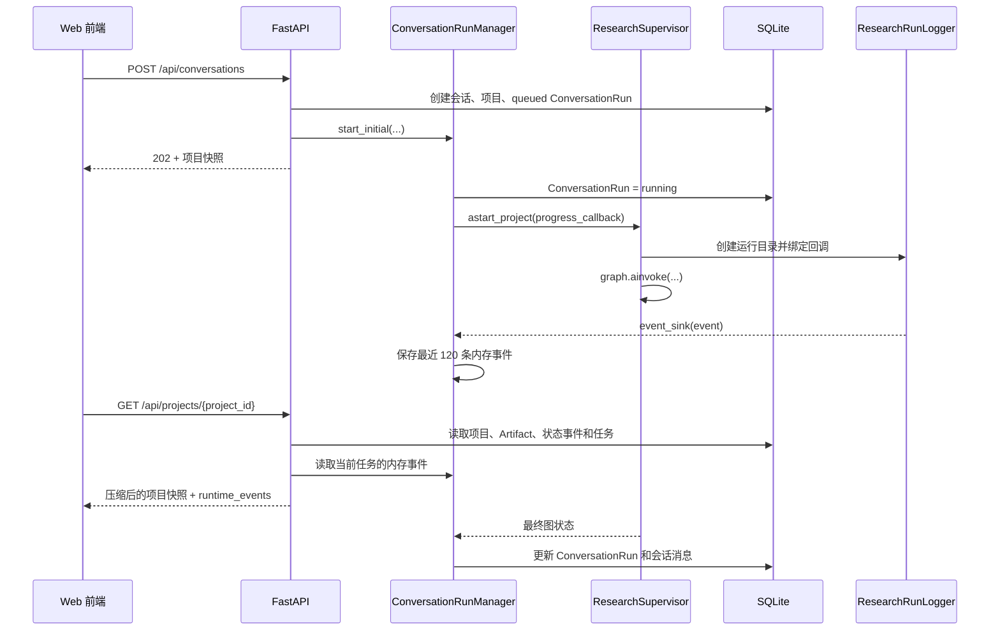

# 运行时可观测性与产物导出

本文说明一次研究运行如何从入口进入 Supervisor、怎样产生回调事件与持久化状态、Web 前端如何获得进度，以及出现故障时应按什么顺序定位。

项目同时维护四层可观测数据。它们用途不同，排障时需要先判断正在查看哪一层：

| 层次 | 主要载体 | 保存位置 | 典型用途 |
| --- | --- | --- | --- |
| 领域事实 | 项目阶段、Artifact、状态事件 | SQLite | 判断研究实际推进到哪里、哪些产物已经提交 |
| Web 任务 | `ConversationRun`、会话消息 | SQLite | 判断后台任务是排队、运行、等待输入、成功或失败 |
| 实时进度 | `ResearchRunLogger` 的事件副本 | API 进程内存 | 给 Web 前端展示当前搜索轮次和活动时间线 |
| 技术诊断 | `run.json`、JSONL、最终结果和报告 | `.research-agent/runs/` | 还原模型调用、工具调用及运行收尾过程 |

`.research-agent/outputs/` 是领域事实的可读镜像，适合人工查看和外部工具消费。SQLite 仍是项目状态的权威来源。

---

## 1. 数据目录和三套运行标识

默认数据目录由 `Settings.data_dir` 决定，缺省值为项目工作目录下的 `.research-agent/`：

```text
.research-agent/
├── research_agent.db
├── runs/
│   └── 20260728T101530-a1b2c3d4/
└── outputs/
    └── <project-id>/
```

一次 Web 研究可能同时出现三种 ID：

| ID | 示例 | 产生位置 | 用途 |
| --- | --- | --- | --- |
| 会话任务 ID | `RUN-20260728T101530-a1b2c3d4` | `SQLiteRepository.create_conversation_run()` | API 查询、同会话并发约束、前端任务状态 |
| 技术日志 ID | `20260728T101530-e5f6a7b8` | `ResearchRunLogger` | `.research-agent/runs/<id>/` 目录名 |
| 回调 ID | LangChain UUID | 模型和工具回调 | 在 `messages.jsonl` 中关联父子调用 |

当前实现没有把会话任务 ID直接写入技术日志元数据，也没有在 `ConversationRun` 中保存日志目录 ID。需要跨层关联时，使用 `thread_id`、`project_id`、主题和时间戳共同定位。

同一项目可以经历多次后台任务，每次继续研究都会新建 `ConversationRun` 和新的技术日志目录。

---

## 2. 推荐的 Web 后台运行链路

Web 首页采用“创建会话 + 后台执行 + 轮询快照”的流程：



### 2.1 任务创建和并发约束

`ConversationRunManager._start()` 先在 SQLite 中创建状态为 `queued` 的任务，再启动进程内 `asyncio.Task`。数据库有一个条件唯一索引：同一会话同时只能存在一个 `queued` 或 `running` 任务。

由此得到以下行为：

- 同一会话重复启动会被拒绝；
- 不同会话可以并行运行；
- 用户只能读取和操作自己作用域内的会话与任务；
- API 进程关闭时，管理器会取消仍在本进程执行的任务，并把它们记为 `interrupted`。

`ConversationRun` 的记录持久化在 SQLite；实际 `asyncio.Task` 只存在于启动它的 API 进程。当前架构没有跨进程任务队列，因此多进程部署和进程重启时需要把“数据库里仍显示运行”与“执行协程仍存活”分开判断。

### 2.2 回调事件如何进入 Web 快照

`astart_project()` 和 `acontinue_project()` 会创建 `ResearchRunLogger`，并把 `ConversationRunManager` 提供的回调设为日志器的 `event_sink`。每次 `emit()` 都执行两件事：

1. 追加到日志目录的 `events.jsonl`；
2. 把同一条事件的副本交给后台管理器。

管理器按会话任务 ID保存内存事件：

- 每个任务最多保留最近 120 条；
- 管理器最多保留最近创建的 50 个任务的事件列表；
- API 重启后这些事件全部消失；
- `event_sink` 抛出的异常会被日志器吞掉，避免展示层故障中断研究图。

GET `/api/projects/{project_id}` 和 GET `/api/conversations/{conversation_id}` 会选择当前活动任务；没有活动任务时选择最新任务，然后把相应的内存事件放进 `runtime_events`。

GET `/api/runs/{run_id}` 只返回持久化的 `ConversationRun`，不会读取日志目录，也不会返回 `events.jsonl`。

### 2.3 后台任务如何收尾

研究图返回后，管理器重新读取项目的权威阶段，再映射成 Web 任务状态：

| 项目阶段 | `ConversationRun.status` | 含义 |
| --- | --- | --- |
| `SEARCH_REVIEW_PENDING` | `awaiting_input` | 等待用户审核候选论文 |
| `REVIEWED` | `interrupted` | 审查要求修改，等待用户选择继续方式 |
| `COMPLETED` | `completed` | 正式研究流程完成 |
| `INCONCLUSIVE` | `inconclusive` | 证据不足或用户主动停止 |
| 其他非终态 | `interrupted` | 本次图执行结束，但项目仍未进入预期停点 |
| 未处理异常 | `failed` | 后台执行失败，错误摘要写入任务记录 |
| API 关闭导致取消 | `interrupted` | 当前实现使用停止阶段和中断状态收尾 |

数据库枚举还允许 `cancelled`，当前后台管理器没有代码路径会写入该值。

管理器会把图状态中最后一条非空模型消息追加为会话 assistant 消息。发生未处理异常时，会追加一条 system 失败消息。

---

## 3. CLI 和兼容 SSE 入口

### 3.1 CLI

`research-agent run` 调用 `ResearchSupervisor.invoke_with_fallback(show_progress=True)`。日志器会把重要事件以 `[进度]` 文本输出到终端，同时完整写入运行目录。运行结束后，CLI 还会打印：

- 项目当前权威阶段；
- Agent 最后一条回复，明确作为过程说明或草稿；
- 技术日志目录；
- 离线降级时的 JSON 结果和提示。

CLI 的降级发生在同一个 `invoke_with_fallback()` 生命周期里，所以日志器会写入 `run.fallback`，最终技术状态为 `fallback`。

### 3.2 兼容研究 SSE

POST `/api/research/stream` 直接消费 `ResearchSupervisor.astream()`：

| SSE 事件 | 来源 |
| --- | --- |
| `update` | LangGraph `stream_mode="updates"` 的图更新 |
| `awaiting_input` | Supervisor 在搜索审核停点生成的自定义事件 |
| `done` | 流正常结束 |
| `fallback` | API 捕获可降级的可用性异常后运行离线降级 |
| `error` | 其他异常 |

这些 `update` 是图更新，不等同于 `ResearchRunLogger.events.jsonl` 中的回调事件。当前 Web 首页使用后台任务与轮询，`startResearchLegacy()` 才保留兼容 SSE 消费逻辑，现有页面没有调用它。

POST `/api/research/invoke` 也属于兼容入口。它等待 `ResearchSupervisor.ainvoke()`，再由 API 层决定是否调用离线降级。

需要注意入口差异：`ainvoke()` 或 `astream()` 内部的日志器先以 `error` 收尾并抛出包装后的异常，API 随后才单独执行 `OfflineFallback`。因此 API 返回的结果可能是 `fallback`，对应技术日志仍显示 `error`。CLI 的日志则会明确显示 `fallback`。

---

## 4. ResearchRunLogger 生命周期

以下 Supervisor 方法会创建技术日志器：

- `invoke()`
- `ainvoke()`
- `astream()`
- `invoke_with_fallback()`
- `astart_project()`
- `acontinue_project()`

工作台普通对话、论文问答和 Library QA 直接调用模型，没有接入这套研究图日志器。

日志器初始化时立即完成：

1. 生成技术日志 ID并创建目录；
2. 写入初始 `run.json`；
3. 追加 `run.started` 到 `events.jsonl`；
4. 初始化搜索轮次、论文处理数和工具调用映射等内存计数器。

LangGraph 配置中的 callbacks 会把模型和工具事件发送给日志器。JSONL 追加操作由进程内可重入锁保护；不同进程同时写同一文件不在设计范围内。

---

## 5. 单次运行目录

典型目录如下：

```text
.research-agent/runs/<technical-run-id>/
├── run.json
├── events.jsonl
├── messages.jsonl
├── final-result.json
├── final-report.md
└── summary.json
```

部分文件按需产生。例如没有模型或工具回调时可能没有 `messages.jsonl`；没有可写的最终字典结果时可能没有 `final-result.json`；没有非空模型正文时不会生成报告。

### 5.1 `run.json`

运行开始时写入：

- `run_id`
- `thread_id`
- `topic`
- `research_question`
- `started_at`
- `status: running`

收尾时更新：

- `finished_at`
- `status`
- `project_id`
- `project_stage`
- `run_status`
- `result_path`
- `report_path`
- `error`

`run.json` 是技术运行元数据，不负责证明某个 Artifact 已经事务提交。项目阶段和 Artifact 应回到 SQLite 核实。

### 5.2 `events.jsonl`

每行都是独立 JSON：

```json
{
  "timestamp": "2026-07-28T10:15:30.123456+00:00",
  "type": "search.started",
  "message": "开始第 1 轮多源检索",
  "data": {
    "scope": "portfolio",
    "round": 1
  }
}
```

事件面向进度展示和人工排障，主要类别包括：

- 运行：`run.started`、`run.fallback`、`run.inconclusive`、`run.finished`；
- 模型：`llm.thinking`、`llm.tool_choice`、`llm.invalid_tool_calls`、`llm.tool_call_parse_gap`、`llm.reply`、`llm.error`；
- 检索：`search.started`、`search.results`、`search.rate_limited`、`search.failed`、`search.synthesizing`、`search.summary`、`search.screening`；
- 论文：`paper.started`、`pdf.fetch_started`、`pdf.fetched`、`pdf.unavailable`、`paper.completed`；
- 产物：`artifact.committing`、`artifact.saved`、`artifact.committed`、`artifact.commit_failed`；
- 阶段：`stage.transition`、`stage.changed`、`stage.rejected`；
- 通用工具：`tool.started`、`tool.completed`、`tool.error`。

`llm.thinking` 表示模型请求已经开始，不包含模型的隐藏推理过程。

部分事件计数属于展示型统计：

- 多轮搜索摘要里的 `unique_count` 会累加每轮内部去重数，跨轮重复项可能被重复计数；
- 论文进度分母依赖本次日志器是否观察到筛选保存工具，在“人工审核后继续”的运行中可能缺失；
- 工具开始和完成事件只能证明回调发生，Artifact 与阶段是否成功落库仍由领域事实决定。

最终候选数量应以 `SearchReport`、`SupplementalSearchReport`、`CandidateSetSnapshot` 和 `ScreeningDecision` 为准。

### 5.3 `messages.jsonl`

该文件保存更细的模型和工具转录记录：

- `llm.request`：序列化后的模型信息、消息和回调父子 ID；
- `llm.response`：模型响应、解析后的工具调用和诊断信息；
- `tool.request`：工具名称和输入；
- `tool.response`：工具输出；
- 模型或工具错误。

模型响应诊断会记录：

- 已解析的工具调用；
- 无效工具调用；
- `finish_reason`；
- 工具调用解析状态；
- 原始 Provider 响应是否存在；
- 经选择性脱敏后的原始响应。

典型解析状态包括：

| `parse_status` | 含义 |
| --- | --- |
| `parsed_tool_calls` | LangChain 成功解析出工具调用 |
| `no_tool_calls` | Provider 没有返回工具调用 |
| `invalid_tool_calls` | 返回了工具调用，但参数解析失败 |
| `tool_call_finish_without_parsed_calls` | Provider 声明以工具调用结束，LangChain 没得到可执行调用 |

OpenAI 和原生 Anthropic 适配器会把原始 Provider 响应放入 generation info，便于诊断畸形工具参数；Bedrock Converse 当前没有同级的自定义原始响应捕获。

### 5.4 脱敏范围和日志敏感性

日志器会递归遮盖键名中含有以下标记的值：

```text
api_key, apikey, authorization, credential, password,
secret, cookie, access_token, refresh_token
```

字符串中的 `Bearer <token>` 也会被遮盖。当前重点脱敏路径是 `llm.response` 及其原始 Provider 响应诊断。

以下内容只经过 JSON 序列化，没有统一递归脱敏：

- `llm.request`
- `tool.request`
- `tool.response`
- 部分错误参数
- 普通事件数据
- 最终结果、运行元数据和报告

这些文件可能包含查询词、论文正文片段、用户输入、工具输出和其他业务敏感数据。运行目录应按敏感调试数据管理，不应直接上传到公开 Issue。当前实现没有日志轮转、容量上限或自动过期清理。

### 5.5 `final-result.json`

图返回字典状态时，日志器会追加 `run_status` 后保存最终状态。这里可能包含消息、项目状态和运行期字段，适合还原最后一次图返回。

该文件不替代 SQLite：写文件与数据库事务分属不同步骤，进程中断时两者可能处于不同时间点。

### 5.6 `final-report.md`

日志器从最后一条非空 AI 消息生成报告，并同时尝试写入：

```text
.research-agent/runs/<run-id>/final-report.md
.research-agent/outputs/<project-id>/final-report.md
```

只有技术运行状态为 `completed` 时，标题才会标为正式完成；其他状态会标为过程草稿。项目级 `final-report.md` 会被后续运行覆盖，且它由日志器直接写入，不经过 `ArtifactExporter` 的临时文件替换流程。

正式成果的结构化依据仍是 `NarrativeReview`、`SectionDraft`、`ReviewOutline` 等 Artifact 和项目阶段。

### 5.7 `summary.json` 与技术状态

技术日志器使用以下状态语义：

| `run_status` | 触发条件 |
| --- | --- |
| `completed` | 请求正常结束，项目为 `COMPLETED` 且审查为 `PASS` |
| `awaiting_input` | 正常结束在 `SEARCH_REVIEW_PENDING` |
| `needs_revision` | 正常结束且审查结论为 `REVISE` |
| `inconclusive` | 正常结束且项目为 `INCONCLUSIVE` |
| `incomplete` | 正常返回，但没有满足以上终态条件 |
| `error` | 本入口捕获到异常并以错误收尾 |
| `fallback` | CLI 同一日志生命周期内进入离线降级 |

如果调用方明确以 `error` 或 `fallback` 收尾，请求状态优先于项目阶段映射。因而项目可能已经保存某些 Artifact，技术运行仍显示 `error`。

`summary.json` 汇总最终状态、项目信息和各文件路径。它在最后一个 `run.finished` 事件写入前生成，所以文件统计和结束事件的先后关系应结合 `events.jsonl` 查看。

运行失败时，工作流通常会保存 `RuntimeIssue` 并保留当前领域阶段；只有真实证据不足、用户停止等业务结论才应进入 `INCONCLUSIVE`。技术错误不能直接解释成研究证据不足。

---

## 6. Web 快照与前端活动时间线

`ResearchService.get_snapshot()` 组合以下持久化数据：

- 项目；
- 全部 Artifact；
- 项目状态事件；
- 会话、全部任务、当前活动任务和会话消息。

API 再附加内存中的 `runtime_events`，并压缩体积较大的候选产物：

- `SearchReport` / `SupplementalSearchReport` 保留计数和来源摘要，清空候选、决策和原因明细；
- `CandidateSetSnapshot` 保留候选、过滤和选择数量，清空候选数组与原因明细。

候选审核专用接口会提供页面真正需要的详细候选数据。

前端每约 1.2 秒轮询项目快照，并从三类信号重建活动历史：

1. 项目状态事件；
2. 新出现的关键 Artifact，例如 `PaperCard` 和 `SectionDraft`；
3. `runtime_events` 中 `data.scope === "portfolio"` 的搜索组合事件。

当前前端只展示 portfolio 范围的以下实时事件：

- `search.started`
- `search.results`
- `search.synthesizing`
- `search.summary`
- `search.screening`

其他模型、工具和 PDF 事件仍会写入技术日志，也可能保存在内存事件列表中，但页面时间线会忽略它们。DOM 活动历史最多保留 14 条。

即使实时事件因重启或上限淘汰而消失，前端仍能用 SQLite 中的阶段事件和 Artifact 恢复较粗粒度的历史。

已知展示限制：

- 前端运行计时基线当前取 `project.created_at`，继续运行时可能显示项目累计年龄；
- 前后端对 `CREATED` 的默认 phase 映射存在差异，后端为 `thinking`，前端静态映射为 `searching`；
- 轮询错误按最佳努力处理并被静默忽略，连续网络故障时页面可能短暂保持旧快照；
- `failed` 和 `interrupted` 会触发重试提示，业务上的 `awaiting_input` 由审核界面接管。

---

## 7. `.research-agent/outputs/` 产物镜像

`ArtifactExporter` 为每个项目维护可读镜像：

```text
.research-agent/outputs/<project-id>/
├── project.json
├── snapshot.json
├── state-events.json
├── final-report.md
└── artifacts/
    ├── 000001-SearchReport.json
    ├── 000002-CandidateSetSnapshot.json
    └── ...
```

### 7.1 导出时机

应用服务在以下操作后刷新镜像：

- 创建项目或会话；
- 保存 Artifact；
- 保存 Artifact 并推进阶段；
- 单独推进项目阶段。

单个 Artifact 文件名包含数据库 Artifact ID和净化后的类型名。结构化 JSON 通过同目录 `.tmp` 文件写入，再用 `replace()` 替换目标文件，降低半写文件概率。

### 7.2 镜像可能滞后的内容

会话任务状态、会话消息、研究笔记和候选选择有部分路径直接更新 Repository，不会立即触发完整项目镜像刷新。因此 `outputs/<project-id>/snapshot.json` 里的运行或会话元数据可能落后于 SQLite，直到下一次服务层导出。

排障优先级建议：

1. SQLite 项目、Artifact 和状态事件；
2. SQLite `ConversationRun` 与会话消息；
3. 技术运行日志；
4. outputs 镜像。

镜像非常适合审阅、备份和外部消费，但不要把它作为任务是否仍在运行的唯一判断来源。

---

## 8. 离线降级的可观测行为

`OfflineFallback` 在 Provider 可用性、认证、限流、网络或超时类错误满足判定时运行。它会：

- 创建或复用项目；
- 保存 `RuntimeFallback` 系统 Artifact；
- 返回 `mode: fallback` 和原因提示；
- 保留项目当前阶段，不生成研究结论。

不同入口的日志表现如下：

| 入口 | 降级执行者 | 技术日志最终状态 |
| --- | --- | --- |
| CLI `invoke_with_fallback()` | Supervisor 内部 | `fallback`，含 `run.fallback` |
| API `/api/research/invoke` | API 捕获异常后 | 原 Agent 日志通常为 `error` |
| API `/api/research/stream` | API 捕获异常后 | 原 Agent 日志通常为 `error`，SSE 发送 `fallback` |

看到 API 返回降级结果、日志目录却显示错误时，应结合 `RuntimeFallback` Artifact 和入口行为解释，不要只依据单个状态字段。

---

## 9. 推荐排障顺序

### 场景 A：页面长时间没有推进

1. GET 项目快照，查看 `active_run.status`、`phase`、`message` 和 `updated_at`；
2. 查看项目 `stage` 与最后一个状态事件；
3. 确认 API 进程是否重启，后台协程是否仍存在；
4. 按主题、thread 和时间找到对应技术日志目录；
5. 查看 `events.jsonl` 最后一条事件，再查看 `messages.jsonl` 的工具请求与响应。

### 场景 B：页面显示失败，但已经生成部分论文卡片

1. 以 SQLite 中已提交的 Artifact 为事实；
2. 查看 `ConversationRun.error` 判断后台异常；
3. 查看 `RuntimeIssue` Artifact；
4. 查看技术 `run_status`，确认是 `error`、`incomplete` 还是等待输入；
5. 从保留的项目阶段决定能否继续运行。

### 场景 C：模型声称调用工具，但没有产物

1. 在 `messages.jsonl` 找到相应 `llm.response`；
2. 检查 `parse_status`、`invalid_tool_calls`、`finish_reason` 和原始 Provider 响应诊断；
3. 检查后续是否出现 `tool.request`；
4. 若工具已执行，查看 `tool.response`、`artifact.commit_failed` 或 `stage.rejected`；
5. 回到 SQLite 核实事务是否提交。

### 场景 D：API 返回 fallback

1. 确认入口是 CLI、同步 API 还是 SSE；
2. 查看项目是否有 `RuntimeFallback`；
3. 检查 Agent 日志最后的 `llm.error` 与 `run.finished`；
4. 认证和令牌问题只在本地安全环境处理，分享日志前进行二次脱敏。

### 场景 E：outputs 与页面不一致

1. 读取 API 项目快照或直接核对 SQLite；
2. 判断最近更新是否属于任务状态、消息、笔记或候选选择；
3. 查看最后一次 Artifact 保存或阶段迁移时间；
4. 等待下一次服务层导出，或通过正常业务操作触发快照刷新。

更具体的故障类型和恢复方式见 [troubleshooting.md](troubleshooting.md)。

---

## 10. 关键实现位置

| 职责 | 文件 |
| --- | --- |
| 技术运行日志与回调解析 | `src/research_agent/infrastructure/run_logger.py` |
| 原始 Provider 响应捕获 | `src/research_agent/infrastructure/observable_chat_model.py` |
| Supervisor 入口与降级判定 | `src/research_agent/agents/supervisor.py` |
| Web 后台任务与内存事件 | `src/research_agent/api/background_runs.py` |
| API 快照和兼容 SSE | `src/research_agent/api/app.py` |
| SQLite 会话任务模型 | `src/research_agent/infrastructure/sqlite_repository.py` |
| 项目快照组装与导出触发 | `src/research_agent/application/research_service.py` |
| outputs 镜像写入 | `src/research_agent/infrastructure/artifact_exporter.py` |
| 离线降级 Artifact | `src/research_agent/application/fallback.py` |
| 前端轮询与活动时间线 | `src/research_agent/api/frontend/app.js` |

相关回归测试主要位于：

- `tests/test_observability.py`
- `tests/test_conversation_isolation.py`
- `tests/test_frontend_run_failure.py`

---

## 11. 小结

项目的可观测性由“SQLite 领域事实、持久化 Web 任务、内存实时进度、磁盘技术日志、outputs 可读镜像”共同组成。判断流程是否真正完成时，以 SQLite 项目阶段和正式 Artifact 为核心；解释一次执行为何停止时，结合 `ConversationRun` 与技术日志；展示当前体验时，再使用内存事件和前端活动时间线。

这套分层允许模型调用失败后保留已提交成果，也解释了为什么不同页面、API 响应和日志目录可能短时间呈现不同状态。
