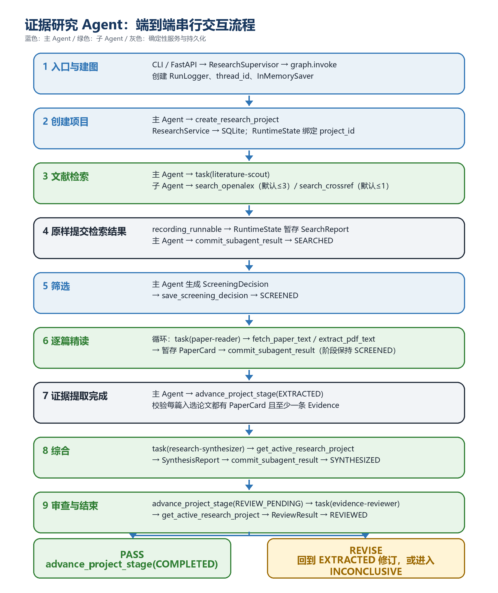
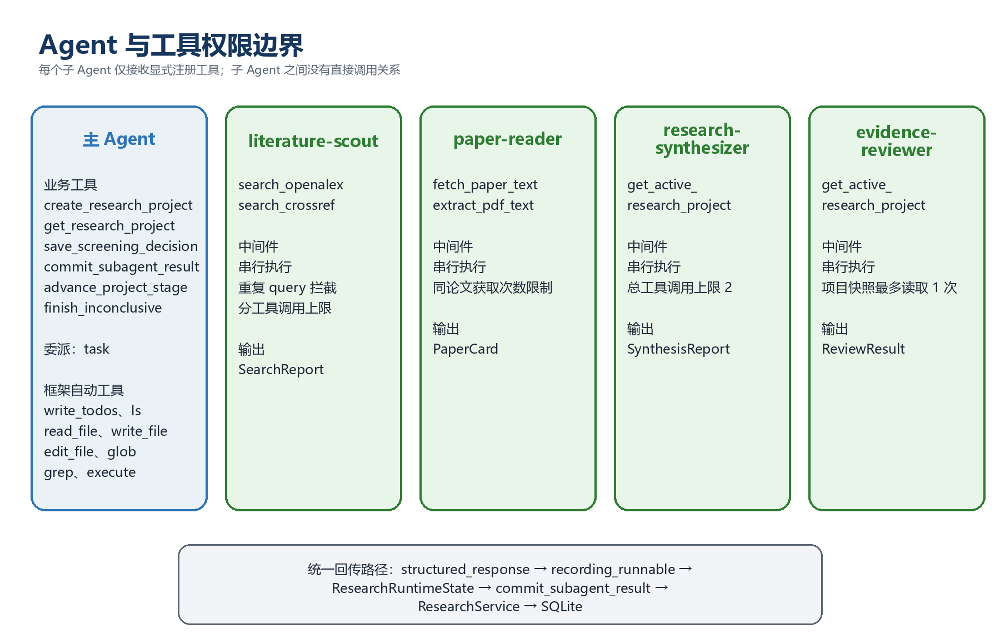

# Research Agent 项目说明

> **项目名称：** Research Agent
> **推荐运行方式：** `research-agent serve --host 127.0.0.1 --port 8000`，浏览器访问 <http://127.0.0.1:8000/>

## 核心架构


- 主 Agent 负责创建项目、委派子 Agent、提交产物和推进状态。
- 8 个专业子 Agent 只调用各自显式授权的窄工具。
- 子 Agent 的结构化结果先写入线程级 `ResearchRuntimeState`，随后由主 Agent 调用 `commit_subagent_result` 提交；Scout 的候选元数据由运行时根据原始搜索结果重建。
- Pydantic 校验、Evidence 引用检查、状态迁移，均由确定性 Python 代码执行。

## 1. 系统架构总览

请求从前端、CLI（命令行入口）或 FastAPI（HTTP 接口入口）进入 `ResearchSupervisor`。前端由 FastAPI 同源托管，直接调用同一组 API。
- Supervisor 指负责统筹整个任务的主 Agent 编排器；
- Worker 指只处理一个专业阶段的子 Agent。
`ResearchSupervisor` 创建 Deep Agents 图，并将主 Agent、8 个专业子 Agent、线程级状态、短期检查点、文件系统后端和业务工具组合到同一运行上下文。


| 层级 | 主要组件 | 职责 | 设计思路 |
|---|---|---|---|
| 入口 | `cli.py`、`api/app.py` | 接收同步、异步和 SSE 请求；处理降级返回 | CLI 与 API 共用同一编排器，避免两套业务流程产生差异 |
| 编排 | `ResearchSupervisor`（主 Agent） | 创建项目、委派子 Agent、推进阶段、输出结果 | 集中掌握项目阶段 |
| 专业（子） Agent | Scout、Reader、Synthesizer、Reviewer、Outliner、Writer、Chief Editor、Fact Checker | 对应检索、精读、综合、证据审查和长篇综述生成链路 | 每个 Agent 只看到完成本职工作所需的工具和 Schema |
| 确定性能力 | 项目工具、文献工具、中间件 | 执行 API、PDF、提交、校验和调用限制 | 把网络请求、文件处理和权限检查交给可测试的 Python 函数 |
| 业务层 | `ResearchService` | Pydantic 产物验证、Evidence 引用检查、前置条件检查 | 防止仅靠 Prompt 约束数据格式和研究证据 |
| 持久化 | SQLite、JSON exporter | 保存项目、产物、状态事件和运行快照 | SQLite 保证事务一致性，JSON 便于人工查看和外部使用 |

表中的“确定性能力”和“业务层”分别回答两个不同的问题。

### 1.1 什么是确定性能力

确定性能力指由普通 Python 函数和中间件执行的具体动作，例如：

- 调用 OpenAlex 或 Crossref API；
- 下载公开 PDF；
- 使用 `pypdf` 提取页面文本；
- 保存筛选参数；
- 限制工具调用次数；
- 拦截重复查询和重复全文获取；
- 把工具结果编码为固定 JSON。

这里的“确定性”主要表示**执行规则由代码明确控制**。例如 `search_openalex(query, limit)` 一定会把 `limit` 限制到 1～20，并按固定字段返回论文元数据；`extract_pdf_text` 一定会先检查路径是否位于工作区。模型只能提供参数，无法临时改变这些执行规则。

外部 API 的论文结果仍可能随数据库更新、网络状态和查询时间发生变化，因此“确定性能力”不代表每次搜索都会返回完全相同的论文列表。它强调的是调用方式、参数边界、错误格式和安全检查具有可预测性。

在 Agent 视角中，这一层通常表现为 Tool。Tool 可以理解为“模型能够按参数调用的 Python 函数”。模型负责判断何时调用，函数负责真正执行网络、文件或数据动作。

### 1.2 什么是业务层

业务层由 `ResearchService` 代表，负责判断：**这项操作在当前科研项目中是否合理、是否满足流程规则。**

它不负责决定主 Agent 下一步想做什么，也不直接处理模型推理。它主要检查：

- 当前项目处于什么阶段；
- 保存的 Artifact 是否符合 Pydantic Schema；
- 当前阶段需要的前置产物是否已经存在；
- `PaperCard` 是否属于筛选入选论文；
- 是否每篇入选论文都有对应 `PaperCard`；
- `SynthesisReport` 引用的 Evidence ID 是否真实存在；
- 综合报告中的数字能否在对应引文中找到；
- `PASS` 审查是否至少验证了一条 Evidence；
- 保存产物后是否允许推进到目标阶段。

可以把业务层理解为项目的“规则裁判”。Agent 和 Tool 提出要执行的动作，`ResearchService` 根据当前项目事实决定该动作能否成立。

### 1.3 两者如何配合

以用户确认检索候选集为例：

```text
用户
  → POST /api/projects/{project_id}/search-feedback，action=accept
  → SearchReviewService 读取最新版 CandidateSetSnapshot
  → ResearchService 校验 ScreeningDecision 和当前阶段
  → Repository 在 SQLite 事务中保存产物并推进到 SCREENED
```

其中：

- `SearchReviewService` 属于确定性能力，负责合并候选、校验反馈并调用业务服务；
- `ResearchService` 属于业务层，负责检查数据和阶段是否符合科研工作流；
- Repository 和 SQLite 属于持久化层，负责把已经批准的业务变化可靠保存。

简化理解：

```text
Agent：决定想做什么
Tool / 中间件：按照固定方式执行动作
ResearchService：判断动作是否符合项目规则
Repository / SQLite：保存通过检查的结果
```

主 Agent 通过 Deep Agents 自动生成的 `task` 工具委派子 Agent。子 Agent 完成后返回 `structured_response`；正式产物通过线程级暂存和专用提交工具进入业务层。

这里的几个常用名词含义如下：
- `Tool` 是 Agent 可调用的 Python 函数；
- `Middleware` 是模型与工具之间的拦截层；
- `structured_response` 是按固定 JSON Schema 生成的结构化结果；
- `Artifact` 是保存到项目中的正式产物；
- `Pydantic` 是负责字段类型和必填项校验的 Python 库。

入口层的三个参数：

| 参数 | 含义 | 作用 |
|---|---|---|
| `topic` | 研究主题，例如“小样本遥感图像分类” | 限定文献检索的总体范围 |
| `research_question` | 希望文献回答的具体问题 | 决定检索词、筛选标准和最终综合方向 |
| `thread_id` | 一次会话链的标识；为空时自动生成 UUID | 关联短期图状态、当前项目和暂存的子 Agent 结果 |

> 下面一段我自己也没细看（）

这三个参数由不同入口传给同一个 Supervisor 方法族：

| 函数 | 使用场景 | 主要返回 |
|---|---|---|
| `invoke(topic, research_question, thread_id=None, show_progress=False)` | CLI 或 Python 同步调用 | 完整 Agent 结果和确定性项目状态 |
| `ainvoke(topic, research_question, thread_id=None)` | FastAPI 异步请求 | 异步返回完整结果 |
| `astream(topic, research_question, thread_id=None)` | SSE 流式接口 | 逐个返回 LangGraph 更新事件 |
| `invoke_with_fallback(...)` | CLI 带降级执行 | 正常 Agent 结果或可追踪的离线降级结果 |

`show_progress` 控制是否在终端打印模型、工具和阶段变化；它不影响业务结果。`build_prompt` 把主题和问题转换为主 Agent 用户消息，`build_config` 把 `thread_id` 放入 LangGraph 的 `configurable` 配置。

## 2. 端到端交互流程图



### 2.1 状态主线

```text
CREATED → SEARCHED → SEARCH_REVIEW_PENDING → SCREENED → EXTRACTED → SYNTHESIZED → REVIEW_PENDING → REVIEWED → OUTLINED → NARRATED → COMPLETED
```

上述各 `stage` 表示项目当前完成到哪一步，让数据库能够确定回答“项目现在进行到哪里、已经具备哪些正式产物”。

| 阶段 | 简单含义 | 进入该阶段时已经满足的条件 | 设置该阶段的思路 |
|---|---|---|---|
| `CREATED` | 项目已创建 | SQLite 中已有 `ResearchProject`，包含 `project_id`、主题和研究问题 | 先建立稳定项目 ID，后续所有 Agent 结果才能绑定到同一项目 |
| `SEARCHED` | 文献检索已完成 | 已保存并校验 `SearchReport`，真实检索词和候选论文可追踪 | 将“已经搜索过”与“尚未开始搜索”区分开，空候选也可以在此处正常结束 |
| `SEARCH_REVIEW_PENDING` | 候选论文等待人工审核 | 已保存 `CandidateSetSnapshot`，检索词、候选集、排除项和轮次可追踪 | 允许用户补充检索词、增删论文，再显式确认入选集 |
| `SCREENED` | 候选论文筛选已完成 | 已保存 `ScreeningDecision`，入选和排除论文 ID 已确定 | Reader 只能处理明确入选的论文，避免把检索候选直接当成精读结果 |
| `EXTRACTED` | 论文证据提取已完成 | 每篇入选论文都有 `PaperCard`，并且至少存在一条可追踪 Evidence | 确认综合所需的证据材料已经齐备，阻止 Synthesizer 使用不完整论文卡片 |
| `SYNTHESIZED` | 跨论文综合已完成 | 已保存 `SynthesisReport`，其中引用的 Evidence ID 已通过校验 | 将“单篇证据已经提取”和“跨论文结论已经形成”分开审计 |
| `REVIEW_PENDING` | 综合报告已提交审查 | `SynthesisReport` 已持久化，项目等待独立 Reviewer 读取 | 给 Reviewer 设置明确入口，防止它在综合报告尚未稳定时提前审查 |
| `REVIEWED` | 证据审查已完成 | 已保存 `ReviewResult`，Verdict 为 `PASS` 或 `REVISE` | 审查完成不等于项目完成；`REVISE` 仍需返回证据或综合阶段修改 |
| `OUTLINED` | 综述结构已确定 | `ReviewResult.verdict == PASS` 且已保存 `ReviewOutline` | 固定章节、论文和 Evidence 分配后再逐节写作 |
| `NARRATED` | 完整综述已整合 | 已保存 `NarrativeReview` | 将正文整合与最后的逐节事实核查分开记录 |
| `COMPLETED` | 项目流程完成 | 已生成 `NarrativeReview` 和各节 `FactCheckReport` | 完成证据审查、写作和事实核查全链路 |
| `INCONCLUSIVE` | 流程受控终止 | 已保存 `InsufficientEvidence`，记录证据不足、用户停止或连续结构化结果失败等原因 | 阻止系统在无法安全继续时生成缺乏依据的结论；具体原因需要读取 Artifact 和首个失败事件 |

一条正常成功路径对应的正式产物如下：

```text
CREATED
  → SearchReport                         → SEARCHED
  → CandidateSetSnapshot                 → SEARCH_REVIEW_PENDING
  → SearchFeedback（可多轮）             → SEARCH_REVIEW_PENDING
  → ScreeningDecision                    → SCREENED
  → 每篇入选论文的 PaperCard             → EXTRACTED
  → SynthesisReport                      → SYNTHESIZED
  → 准备审查                             → REVIEW_PENDING
  → ReviewResult(PASS)                   → REVIEWED
  → ReviewOutline                        → OUTLINED
  → SectionDraft（每节一份）             → OUTLINED
  → NarrativeReview                      → NARRATED
  → FactCheckReport（每节一份）          → NARRATED
  → 全部章节核查结束                     → COMPLETED
```

## 3. 各阶段的工具调用链

本节按实际执行顺序展开。阅读每个阶段时，可以先看“阶段卡片”了解输入、输出和状态变化，再阅读后面的调用步骤、参数说明、设计原因和失败分支。

| 小节 | 阶段目标 | 主执行者 | 核心函数 | 正常输出 |
|---|---|---|---|---|
| 3.1 | 建立项目身份 | 主 Agent | `create_research_project` | `ResearchProject`，阶段为 `CREATED` |
| 3.2 | 检索并提交候选论文 | 主 Agent + Scout | `task`、`search_openalex`、`search_crossref`、`commit_subagent_result` | `SearchReport` 与候选集快照，非空时进入 `SEARCH_REVIEW_PENDING` |
| 3.3 | 处理零候选或证据不足 | 主 Agent | `finish_inconclusive` | `InsufficientEvidence`，阶段为 `INCONCLUSIVE` |
| 3.4 | 补充检索并固定论文集合 | 用户 + `SearchReviewService` | 检索反馈 API、`search_openalex`、`verify_doi` | 多轮反馈；确认后保存 `ScreeningDecision` 并进入 `SCREENED` |
| 3.5 | 逐篇提取可定位证据 | 主 Agent + Reader | `task`、`fetch_paper_text`、`extract_pdf_text`、`commit_subagent_result` | 多个 `PaperCard`，随后进入 `EXTRACTED` |
| 3.6 | 基于 Evidence 形成跨论文综合 | 主 Agent + Synthesizer | `task`、`get_active_research_project`、`commit_subagent_result` | `SynthesisReport`，阶段为 `SYNTHESIZED` |
| 3.7 | 独立审查并决定结束方式 | 主 Agent + Reviewer | `advance_project_stage`、`task`、`commit_subagent_result` | `ReviewResult`，随后完成、修订或证据不足终止 |
| 3.8 | 生成并核查长篇综述 | 主 Agent + 四个写作子 Agent | `task`、`get_active_research_project`、`commit_subagent_result` | `ReviewOutline`、多份 `SectionDraft`、`NarrativeReview` 和多份 `FactCheckReport` |

### 3.1 创建项目

> **阶段卡片**  
> **目标：** 创建可持久化的科研项目，并获得后续全流程使用的唯一 `project_id`。  
> **输入：** `topic`、`research_question`、当前运行的 `thread_id`。  
> **执行者：** 主 Agent。  
> **输出：** `ResearchProject` JSON。  
> **状态：** 新项目处于 `CREATED`。

**调用步骤**

1. 主 Agent 调用： `create_research_project(topic, research_question)`
2. `ResearchWorkflowGuardMiddleware` 允许该工具作为第一个业务调用。
3. 工具调用 `ResearchService.create_project`。
4. Repository 插入 `projects` 记录并导出项目快照。
5. `ResearchRuntimeState.register_project` 将 `thread_id` 与真实 `project_id` 绑定，并清理该线程旧的暂存结果。

**参数说明**

`create_research_project` 的参数：

| 参数 | 类型 | 解释 |
|---|---|---|
| `topic` | `str` | 项目研究主题 |
| `research_question` | `str` | 本项目需要回答的研究问题 |
| `runtime` | `ToolRuntime` | LangChain 自动注入，模型无需填写；用于取得当前 `thread_id` |

**设计原因**

返回的 `project_id` 是项目在 SQLite 中的唯一标识。后续提交工具使用该原始值，避免把其他项目的数据写入当前项目。先创建项目再委派子 Agent，也能让所有日志、产物和状态事件从任务开始就有明确归属。

调用链：

```text
主 Agent
  → create_research_project
  → ResearchService.create_project
  → SqliteResearchRepository.create_project
  → INSERT projects
  → RuntimeState.register_project
```

### 3.2 文献检索与 SEARCHED

> **阶段卡片**  
> **目标：** 使用受限、可追踪的学术检索获得候选论文。  
> **输入：** 项目主题和研究问题。  
> **执行者：** 主 Agent 委派 `literature-scout`。  
> **输出：** `SearchReport`。  
> **状态变化：** `CREATED → SEARCHED`。

**调用步骤**

1. 主 Agent 委派检索子 Agent：

   ```text
   task(
     subagent_type="literature-scout",
     description="研究主题和研究问题"
   )
   ```

   `task` 是主 Agent 委派子 Agent 的统一工具。其中 `subagent_type` 指定要运行的子 Agent 注册名；`description` 是发送给该子 Agent 的任务文本；`runtime` 由框架自动注入。统一使用 `task` 可以让 WorkflowGuard 在所有委派发生前执行相同的阶段和权限检查。

2. WorkflowGuard 检查：

   - 项目是否已经创建；
   - 当前阶段是否为 `CREATED`；
   - 当前线程没有未提交的 Scout 结果；
   - 本项目尚未委派过 `literature-scout`。

3. Scout 串行调用：

   ```text
   search_openalex(query, limit)
   search_crossref(query, limit)  # 配置允许时
   ```

   两个检索函数都使用 `query` 表示本次实际发送给学术 API 的检索词，`limit` 表示本次期望返回的记录数，工具内部会把它限制在 1～20。OpenAlex 是主要论文元数据来源；Crossref 是 DOI 元数据服务，适合作为补充检索源。

4. 默认调用预算：

   当前默认值主要服务于演示和测试速度，并非不可调整的理论最优值。实际部署时可根据 API 额度、研究范围和召回率要求配置。

   | 工具 | 默认上限 | 达到上限后的行为 |
   |---|---:|---|
   | `search_openalex` | 3 | 使用已经取得的结果继续生成报告 |
   | `search_crossref` | 1 | 使用已经取得的结果继续生成报告 |

   对应环境变量分别为 `RESEARCH_AGENT_MAX_OPENALEX_SEARCHES` 和 `RESEARCH_AGENT_MAX_CROSSREF_SEARCHES`。Crossref 上限设置为 `0` 时，该工具不会注册给 Scout。外部请求的重试次数、初始退避秒数和最大等待时间分别由 `RESEARCH_AGENT_SEARCH_MAX_RETRIES`、`RESEARCH_AGENT_SEARCH_BACKOFF_SECONDS` 和 `RESEARCH_AGENT_SEARCH_MAX_RETRY_WAIT_SECONDS` 控制。

5. `ExecutedSearchTrackingMiddleware`（已执行搜索追踪中间件）：

   - 记录实际执行的查询词；
   - 规范化查询意图；
   - 拦截重复查询；
   - 捕获 OpenAlex/Crossref 的原始论文元数据并存入线程级运行时状态；
   - 返回结构化 `duplicate_search_query` 错误。

6. 文献工具内部处理 HTTP 429、服务端错误、`Retry-After` 和指数退避。
7. Scout 根据标题和摘要输出候选 ID、`include/exclude/uncertain` 三态决定、理由、覆盖盲区和检索迭代日志。
8. `recording_runnable` 使用真实执行记录覆盖 `search_terms`，并根据 `candidate_ids` 从捕获的原始结果中重建完整 `candidates`，再将结果存入 `ResearchRuntimeState`。
9. 主 Agent 调用：`commit_subagent_result(project_id, "literature-scout")`

10. 系统读取已重建的暂存结果，保存 `SearchReport` 并原子推进：`CREATED → SEARCHED`。
11. 候选非空时，系统保存 `CandidateSetSnapshot` 并进入 `SEARCH_REVIEW_PENDING`；本次 Agent 执行返回 `awaiting_input`。

**设计原因**

这里限制 Scout 只能委派一次，并限制具体检索工具的调用次数，主要用于控制外部 API 成本、匿名额度和重复搜索。`search_terms` 最终由实际工具日志覆盖；论文标题、作者、摘要、DOI 等字段直接来自工具原始结果，可减少模型复述完整元数据造成的丢失和格式错误。

用户可以在审核阶段提交新的检索词、手动加入 DOI 或论文元数据、排除候选。系统去重查询和论文，并将每轮反馈持久化。

`SearchReport` 的字段直接服务于筛选阶段：

| 字段 | 含义 |
|---|---|
| `query` | 原始检索目标 |
| `search_terms` | 工具实际执行过的查询词 |
| `candidates` | 由运行时从原始搜索结果重建的完整候选论文列表 |
| `candidate_ids` | Scout 初筛后保留的论文 ID |
| `screening_decisions` | 每篇论文的 `include`、`exclude` 或 `uncertain` 决定 |
| `screening_reasons` | 排除或待确认论文的简短理由 |
| `coverage_gaps` | 当前检索覆盖不足的方向 |
| `search_iteration_log` | 每轮查询、返回数、新增数和策略理由 |
| `selection_notes` | 检索、去重和候选选择说明 |

### 3.3 空检索结果

> **阶段卡片**  
> **触发条件：** `SearchReport.candidates` 为空，或已有检索无法提供可继续处理的候选。  
> **执行者：** 主 Agent。  
> **输出：** `InsufficientEvidence`。  
> **状态变化：** `SEARCHED → INCONCLUSIVE`。  
> **结果性质：** 正常终止，表示证据不足，并非系统崩溃。

**调用步骤**

如果 `SearchReport.candidates` 为空，主 Agent立即调用：

```text
finish_inconclusive(
  project_id,
  reason,
  queries_attempted,
  search_failures,
  recommendation
)
```

随后保存 `InsufficientEvidence` 并推进：

```text
SEARCHED → INCONCLUSIVE
```

此分支不会创建空的 `ScreeningDecision`，也不会继续精读和综合。

**参数说明**

`finish_inconclusive` 各参数的含义：

| 参数 | 解释 |
|---|---|
| `project_id` | 当前项目的真实 ID |
| `reason` | 为什么现有证据不足 |
| `queries_attempted` | 实际尝试过的检索词 |
| `search_failures` | API、网络或数据处理失败说明 |
| `recommendation` | 后续如何调整问题、检索词或证据来源 |

**设计原因**

保留 `INCONCLUSIVE` 分支，是为了把“没有足够证据”作为合法研究结果保存，避免系统为了完成流程而补造论文或结论。

### 3.4 筛选与 SCREENED

> **阶段卡片**
> **目标：** 让用户补充检索方向、增删候选，并显式确定哪些论文进入精读。
> **输入：** 已保存的 `CandidateSetSnapshot`。
> **执行者：** 用户与 `SearchReviewService`。
> **输出：** `SearchFeedback`、可选的 `SupplementalSearchReport`、新版 `CandidateSetSnapshot`；确认时生成 `ScreeningDecision`。
> **状态变化：** 补充检索保持 `SEARCH_REVIEW_PENDING`；确认后 `SEARCH_REVIEW_PENDING → SCREENED`。

**产物格式**

用户通过反馈接口提交：

```json
{
  "action": "refine",
  "suggested_queries": ["新的检索方向"],
  "added_papers": [{"doi": "10.xxxx/example"}],
  "excluded_paper_ids": ["P002"],
  "comment": "排除相邻问题，补充目标领域检索"
}
```

**调用函数**

```text
POST /api/projects/{project_id}/search-feedback
```

**参数与设计原因**

`action=refine` 会执行去重后的补充检索并停留在人工审核阶段；`action=accept` 把当前未排除候选固化为入选集；`action=stop` 保存证据不足说明并结束。手动 DOI 会先经 Crossref 核验；未提供 DOI 的手工论文标记为 `user-unverified`，用户填写的摘要不会进入后续证据链。

该工具在同一业务动作中完成：

```text
保存 SearchFeedback
  → 可选补充检索和 DOI 核验
  → 保存新版 CandidateSetSnapshot
  → accept 时校验并保存 ScreeningDecision
  → SEARCH_REVIEW_PENDING → SCREENED
  → POST /api/projects/{project_id}/continue
```

### 3.5 逐篇精读与 EXTRACTED

> **阶段卡片**  
> **目标：** 为每篇入选论文形成结构化阅读卡片和可定位 Evidence。  
> **输入：** `ScreeningDecision.included_paper_ids` 及对应候选论文完整元数据。  
> **执行者：** 主 Agent 逐篇委派 `paper-reader`。  
> **输出：** 每篇论文一个 `PaperCard`。  
> **状态变化：** 保存单个 `PaperCard` 时保持 `SCREENED`；全部完成后进入 `EXTRACTED`。

主 Agent 按入选论文逐篇执行。

**单篇论文调用链**

```text
主 Agent
  → task(paper-reader, 完整论文元数据) # 调用 paper-reader 子agent，传入相应论文元数据
  → fetch_paper_text 或 extract_pdf_text # 获取论文内容
  → PaperCard structured_response 
  → recording_runnable
  → RuntimeState 暂存
  → commit_subagent_result(project_id, "paper-reader")
  → ResearchService.save_artifact("PaperCard")
```

**为什么逐篇处理**

逐篇委派的原因是每篇论文的 PDF 获取、Evidence 和错误状态彼此独立。收到一篇 `PaperCard` 后立即提交，可以准确识别失败论文，也能避免多个 Reader 结果覆盖同一个 `(thread_id, "paper-reader")` 暂存槽。

#### `fetch_paper_text`

函数签名及参数：

```text
fetch_paper_text(paper_id, doi="", url="", max_pages=30)
```

| 参数 | 解释 |
|---|---|
| `paper_id` | 真实论文 ID，也是 PDF 缓存键的一部分 |
| `doi` | 可选 DOI，用于识别论文或查询开放位置 |
| `url` | 可选论文页面或公开 PDF 地址 |
| `max_pages` | 最多提取的页数，默认 30 |

**工具内部动作**

1. 根据 DOI、URL 和 OpenAlex ID 查找开放 PDF。
2. 优先尝试 arXiv 或 OpenAlex 开放访问地址。
3. 拒绝 localhost、私网地址和非 HTTP/HTTPS URL。
4. 下载内容上限为 25 MB。
5. 验证响应以 `%PDF` 开头。
6. 保存到工作区 `/papers`。
7. 使用 `pypdf` 提取带页码文本。

工具会根据 `paper_id + doi + url` 生成哈希文件名。对应 PDF 已存在时直接读取缓存并返回 `cached: true`，可以减少跨线程或重复项目的网络下载。

#### `extract_pdf_text`

仅在任务明确提供有效 `local_pdf_path` 时使用：

```text
extract_pdf_text(pdf_path, max_pages)
```

`pdf_path` 是工作区内的 PDF 路径，例如 `/papers/example.pdf`；`max_pages` 是最多提取页数。工具会验证解析后的路径位于工作区内部，然后使用 `pypdf` 提取页面文本。路径限制用于防止 Agent 读取科研工作区之外的本机文件。

#### `fetch_paper_text` 与 `extract_pdf_text` 的区别

两个工具最终都会使用 `pypdf` 提取页面文本，主要区别在于 PDF 的来源和前置动作：

| 对比项 | `fetch_paper_text` | `extract_pdf_text` |
|---|---|---|
| 主要用途 | 在线寻找、下载并解析论文 | 解析工作区中已经存在的 PDF |
| 主要输入 | `paper_id`、`doi`、`url` | `pdf_path` |
| 是否联网 | 会尝试访问 arXiv、OpenAlex 或直接 PDF URL | 不联网，只读取本地文件 |
| PDF 来源 | 论文元数据指向的开放获取地址 | `/papers` 等工作区路径 |
| 是否保存文件 | 下载成功后保存到 `/papers` | 不创建新 PDF，只读取已有文件 |
| 缓存行为 | 已有对应缓存时返回 `cached: true` | 直接读取指定路径，无下载缓存步骤 |
| 主要安全检查 | 拒绝私网 URL、限制 25 MB、验证 `%PDF` 文件头 | 拒绝工作区外路径 |
| 常见错误 | `open_full_text_unavailable` | `pdf_not_found`、`pdf_unreadable`、`path_outside_workspace` |

Reader 的选择逻辑：

```text
任务明确提供有效 local_pdf_path
  → extract_pdf_text(local_pdf_path)

任务只提供 paper_id、doi、url 等论文元数据
  → fetch_paper_text(paper_id, doi, url)
```

`fetch_paper_text` 下载成功后会直接调用内部页面提取逻辑并返回 `pages`，因此不需要再额外调用一次 `extract_pdf_text`。`extract_pdf_text` 主要用于用户或上游流程已经把 PDF 放入工作区的场景。

#### PaperFetchGuard

`PaperFetchGuardMiddleware`（PaperFetchGuard中间件） 会：

- 记录同一论文已经使用的 `paper_id + doi + url` 参数组合；
- 拦截完全重复的全文获取调用；
- 限制每篇论文的获取次数；
- 达到上限后要求 Reader 使用已有结果或摘要证据生成 `PaperCard`。

每篇论文的默认获取上限由 `RESEARCH_AGENT_MAX_PAPER_FETCHES_PER_PAPER=2` 控制。这里统计的是不同参数组合的尝试；完全相同的调用会直接返回 `duplicate_paper_fetch`。

**阶段收口**

全部 `PaperCard` 保存后，主 Agent 调用：

```text
advance_project_stage(project_id, "EXTRACTED", "paper-reader")
```

进入 `EXTRACTED` 前，`ResearchService` 检查：

- 每篇入选论文都有对应 `PaperCard`；
- `PaperCard.paper_id` 位于 `ScreeningDecision.included_paper_ids`；
- Evidence 的 `paper_id` 与卡片一致；
- Evidence ID 在卡片内唯一；
- 至少一篇入选论文包含 Evidence。

**失败分支**

如果所有 `PaperCard.findings` 都为空，工具返回 `insufficient_evidence`，主 Agent 随即调用 `finish_inconclusive`。

`PaperCard` 是一篇论文的结构化阅读卡片：

| 字段 | 含义 |
|---|---|
| `paper_id`、`title` | 论文身份信息；`paper_id` 必须与 Reader 输入一致 |
| `research_question` | 该卡片围绕哪个研究问题阅读论文 |
| `methods`、`datasets` | 论文使用的方法和数据集 |
| `findings` | Evidence 列表 |
| `limitations` | 论文局限、全文缺失或证据等级限制 |

Evidence 是可定位的证据条目：

| 字段 | 含义 |
|---|---|
| `evidence_id` | 后续综合和审查使用的唯一引用标识 |
| `paper_id` | 证据所属论文 |
| `claim` | 该引文支持的简要陈述 |
| `quote` | 论文或摘要原文 |
| `page`、`section` | 原文位置；摘要证据通常使用 `section="abstract"`、`page=null` |

### 3.6 综合与 SYNTHESIZED

> **阶段卡片**  
> **目标：** 对已保存的 Evidence 进行跨论文比较，形成共识、冲突、方法比较和研究空白。  
> **输入：** 当前项目中的全部 `PaperCard` 和 Evidence。  
> **执行者：** 主 Agent 委派 `research-synthesizer`。  
> **输出：** `SynthesisReport`。  
> **状态变化：** `EXTRACTED → SYNTHESIZED`。

**调用步骤**

主 Agent 委派：

```text
task(
  subagent_type="research-synthesizer",
  description="原始 project_id、研究主题和研究问题"
)
```

Synthesizer 只可调用：

```text
get_active_research_project()
```

**数据读取方式**

该工具不接受模型提供的 `project_id`。它根据当前 `thread_id` 从 `ResearchRuntimeState` 取得绑定项目，然后读取：

- 项目状态；
- 已保存产物；
- `PaperCard`；
- Evidence；
- 状态事件。

同时返回 `valid_evidence_ids` 和 `evidence_catalog`。前者是综合报告允许引用的 Evidence ID 精确列表，后者提供 Evidence ID、论文 ID 和简要 claim 的对应关系。工具不接受 `project_id`，可以降低模型读取旧项目或猜错项目 ID 的风险。

Synthesizer 输出 `SynthesisReport`，随后主 Agent 调用：

```text
commit_subagent_result(project_id, "research-synthesizer")
```

**提交校验**

提交时会校验：

- `consensus`、`conflicts` 和 `method_comparison` 引用的 Evidence ID 均存在；
- `gap.evidence_ids` 与 `supporting_paper_ids` 对应；
- 假设中的精确数字能够在对应 Evidence 引文中找到。

当前数字校验采用通用正则 `\d+(?:\.\d+)?%?` 提取假设中的数字，再用字符串包含关系检查 Evidence 引文。因此 `2D`、`3DVG`、`FFL-3DOG` 等技术术语可能被误判，`2023` 等较长数字也可能让单独的 `3` 被错误视为已有支持。该限制及诊断方法见[《故障诊断与当前限制》](troubleshooting.md)。

`SynthesisReport` 的结构：

| 字段 | 含义 |
|---|---|
| `topic` | 综合主题 |
| `consensus` | 多篇论文一致支持的陈述 |
| `conflicts` | 论文之间存在冲突的陈述 |
| `method_comparison` | 方法、数据或实验设计比较 |
| `gaps` | 由现有 Evidence 支持的研究空白 |

其中每条综合陈述都绑定 `evidence_ids`，使结论能够回溯到具体引文；`gap` 还会记录支持论文、冲突论文、置信度和待验证假设。

提交成功后：

```text
EXTRACTED → SYNTHESIZED
```

### 3.7 审查与结束

> **阶段卡片**  
> **目标：** 独立检查综合结论能否回溯到真实 Evidence。  
> **输入：** 已保存的 `SynthesisReport`、`PaperCard` 和 Evidence。  
> **执行者：** 主 Agent 委派只读 `evidence-reviewer`。  
> **输出：** `ReviewResult`。  
> **状态变化：** `SYNTHESIZED → REVIEW_PENDING → REVIEWED`，随后根据 Verdict 进入综述写作、回退修订或证据不足终止。

**调用步骤**

主 Agent 先调用：

```text
advance_project_stage(project_id, "REVIEW_PENDING", "research-supervisor")
```

随后委派：

```text
task(
  subagent_type="evidence-reviewer",
  description="原始 project_id"
)
```

Reviewer 可以调用：

```text
get_active_research_project()
```

**审查范围**

DOI继续保存在论文元数据中，用于标识、去重和参考文献导出。Reviewer不进行Crossref联网验证，集中检查 `claim`、`evidence_id`、`quote`、`page` 和 `section` 之间的对应关系。

Reviewer 保持只读权限，是为了让“生成综合报告”和“审查综合报告”由不同角色完成。它只能读取当前项目快照，不能修改 `PaperCard`、`SynthesisReport` 或项目阶段。

Reviewer 输出 `ReviewResult` 后，主 Agent 调用：

```text
commit_subagent_result(project_id, "evidence-reviewer")
```

**提交校验**

提交时检查：

- `verified_evidence_ids` 均为真实 Evidence ID；
- `PASS` 至少验证一条 Evidence；
- `artifact_id` 不能代替 Evidence ID。

`ReviewResult` 的字段：

| 字段 | 含义 |
|---|---|
| `verdict` | 只允许 `PASS` 或 `REVISE` |
| `fatal_issues` | 阻止报告通过的严重问题 |
| `suggestions` | 修改和补证据建议 |
| `verified_evidence_ids` | Reviewer 实际检查过的 Evidence ID |

PASS 至少验证一条 Evidence，可以防止没有证据核验的形式化通过。

状态推进：

```text
REVIEW_PENDING → REVIEWED
```

**最终分支**

| Verdict | 后续动作 |
|---|---|
| `PASS` | 委派 `research-outliner`，进入综述写作链路 |
| `REVISE` | 回到 `EXTRACTED` 修订，或进入 `INCONCLUSIVE` |

### 3.8 长篇综述写作与事实核查

> **阶段卡片**
>
> **目标：** 把已通过证据审查的综合结果扩展为有章节结构、引用链和参考文献的完整综述。
>
> **输入：** `PaperCard`、Evidence、`SynthesisReport` 和 `ReviewResult(PASS)`。
>
> **执行者：** 主 Agent 依次委派 `research-outliner`、`narrative-writer`、`chief-editor` 和 `fact-checker`。
>
> **输出：** `ReviewOutline`、多份 `SectionDraft`、`NarrativeReview` 和多份 `FactCheckReport`。
>
> **状态变化：** `REVIEWED → OUTLINED → NARRATED → COMPLETED`。

调用链如下：

```text
research-outliner
  → ReviewOutline
  → commit_subagent_result
  → OUTLINED

对 ReviewOutline.sections 逐节：
  narrative-writer(section_id, heading, paper/evidence 分配, key_claims, target_words)
    → SectionDraft
    → commit_subagent_result
    → 保持 OUTLINED

chief-editor
  → NarrativeReview
  → commit_subagent_result
  → NARRATED

对 NarrativeReview.sections 逐节：
  fact-checker(section_id)
    → FactCheckReport(PASS/REVISE)
    → commit_subagent_result
    → 保持 NARRATED

全部章节核查结束
  → advance_project_stage(COMPLETED)
```

`ReviewOutline` 为每节分配论文、Evidence、核心论点和目标字数。`narrative-writer` 每次只写一个 `section_id`，并通过 `transition_from`、`transition_to` 提供章节衔接。`chief-editor` 统一摘要、引言、结论、参考文献和 `evidence_chain`。`fact-checker` 逐条检查数字、因果强度、证据归属和引文支持关系，产物当前用于诊断，不会自动改写 `NarrativeReview`。

当前实现会在全部事实核查任务结束后推进到 `COMPLETED`，即使某节 `FactCheckReport.verdict` 为 `REVISE`。因此调用方应同时检查这些报告，判断是否需要人工修订正文。

## 4. Agent 与工具权限边界



这里的“权限”指 Agent 在模型推理时实际能够看到并调用的工具集合。项目按照最小权限原则分配工具：一个角色只获得完成本阶段所需的能力。即使 Prompt 出现遗漏，Agent 也无法调用未注册的业务工具。

### 4.1 权限矩阵

| Agent | 显式业务工具 | 关键限制 | 结构化输出 |
|---|---|---|---|
| 主 Agent | `create_research_project`、`get_research_project`、`save_screening_decision`、`commit_subagent_result`、`advance_project_stage`、`finish_inconclusive`、`task` | 所有调用串行；阶段与委派由 WorkflowGuard 检查 | 最终报告、项目状态 |
| `literature-scout` | `search_openalex`、可选 `search_crossref` | 真实 query 记录、重复拦截、分工具预算；单项目仅委派一次 | `SearchReport` |
| `paper-reader` | `fetch_paper_text`、`extract_pdf_text` | 逐篇委派；全文获取次数限制；公共 URL 与工作区路径校验 | `PaperCard` |
| `research-synthesizer` | `get_active_research_project` | 总工具调用上限 2；仅在 `EXTRACTED` 委派 | `SynthesisReport` |
| `evidence-reviewer` | `get_active_research_project` | 只读业务能力；项目快照最多读取一次；仅在 `REVIEW_PENDING` 委派 | `ReviewResult` |
| `research-outliner` | `get_active_research_project` | 仅在 `REVIEWED` 委派；总工具调用上限 2 | `ReviewOutline` |
| `narrative-writer` | `get_active_research_project` | 仅在 `OUTLINED` 委派；一次只写一个章节 | `SectionDraft` |
| `chief-editor` | `get_active_research_project` | 仅在 `OUTLINED` 委派；整合全部分节草稿 | `NarrativeReview` |
| `fact-checker` | `get_active_research_project` | 仅在 `NARRATED` 委派；按章节核查 | `FactCheckReport` |

八类结构化输出覆盖研究和写作两个阶段。把输出类型与 Agent 一一对应，可以让 `commit_subagent_result` 根据 `subagent_type` 选择固定 Schema、保存方式和目标阶段。

### 4.2 主 Agent 的框架自动工具

`create_deep_agent` 还会通过 Deep Agents 中间件自动注入：

```text
write_todos
ls
read_file
write_file
edit_file
glob
grep
execute
```

这些工具属于框架基础能力，不参与标准科研业务状态推进。

其中 `write_todos` 管理主 Agent 的内部任务清单；`ls`、`glob` 和 `grep` 用于查找工作区内容；`read_file`、`write_file` 和 `edit_file` 处理文件；`execute` 运行后端允许的命令。它们由 Deep Agents 框架自动注入，因此“主 Agent 的显式业务工具列表”与“模型最终可见的全部工具列表”并不完全相同。

### 4.3 主 Agent 隐藏的业务工具

构建主 Agent 时明确过滤以下工具：

```text
save_project_artifact
transition_project_stage
save_artifact_and_transition
save_paper_card
get_active_research_project
search_openalex
search_crossref
fetch_paper_text
extract_pdf_text
verify_doi
```

`verify_doi` 没有分配给任何 Agent，由 `SearchReviewService` 在用户手动加入 DOI 时调用；Reviewer 只读取项目快照并检查现有 Evidence。该实现与 Reviewer Prompt 中“禁止联网核验 DOI”的规则一致。

因此：

- 主 Agent 无法直接检索论文；
- 主 Agent 无法直接下载或解析 PDF；
- 主 Agent 无法直接核验 DOI；
- 主 Agent 无法使用通用写入工具绕过 `commit_subagent_result`；
- 综合器和审查器只能通过线程绑定工具读取当前项目。

隐藏通用保存工具的原因，是防止主 Agent 跳过专用参数和 Pydantic Schema，直接提交任意 JSON。隐藏检索和 PDF 工具则保证专业操作由对应子 Agent 完成，便于设置独立调用预算和错误处理规则。

## 5. 线程级结果暂存与受控提交

`ResearchRuntimeState` 是进程内的线程级临时状态容器。它保存 active project、实际查询词、待提交的子 Agent 结果、拒绝次数和论文获取记录。它与 SQLite 的职责不同：RuntimeState 服务于当前运行中的协调，SQLite 保存跨运行仍需保留的正式业务事实。

正式产物的数据路径：

```text
子 Agent structured_response
  → recording_runnable
  → ResearchRuntimeState.record_result
  → 主 Agent 调用 commit_subagent_result
  → ResearchRuntimeState.pending_result
  → ResearchService
  → Repository / SQLite
  → ResearchRuntimeState.mark_consumed
```

| 步骤 | 组件 | 动作 |
|---:|---|---|
| 1 | 子 Agent `create_agent` | 根据 `response_format` 生成结构化 JSON |
| 2 | `recording_runnable` | 读取 `structured_response`；校正真实 `search_terms` 或 `paper_id` |
| 3 | `ResearchRuntimeState` | 按 `(thread_id, subagent_type)` 暂存，标记为未消费 |
| 4 | 主 Agent | 调用 `commit_subagent_result(project_id, subagent_type)` |
| 5 | 项目工具 | 检查 active project，读取 `pending_result` |
| 6 | `ResearchService` | 规范化、Pydantic 校验、Evidence 引用和前置条件校验 |
| 7 | Repository | 在 SQLite 事务中写产物、更新项目、追加 `state_event` |
| 8 | `ResearchRuntimeState` | `mark_consumed`，允许该类型子 Agent 后续再次运行 |

使用“暂存后提交”的原因，是让主 Agent 只传递 `project_id` 和 `subagent_type`。正式 payload 由系统从 RuntimeState 直接取得，避免主 Agent 复制 JSON 时遗漏字段、改写 `paper_id`、压缩引文或拼错 Evidence ID。

### 5.1 各类提交动作

| 子 Agent 类型 | 保存产物 | 状态变化 |
|---|---|---|
| `literature-scout` | `SearchReport`、`CandidateSetSnapshot` | `CREATED → SEARCHED → SEARCH_REVIEW_PENDING`（非空候选） |
| 检索审核服务 | `SearchFeedback`、可选 `SupplementalSearchReport`、`CandidateSetSnapshot`、确认时的 `ScreeningDecision` | 补充时保持 `SEARCH_REVIEW_PENDING`；确认后进入 `SCREENED` |
| `paper-reader` | `PaperCard` | 保持 `SCREENED` |
| `research-synthesizer` | `SynthesisReport` | `EXTRACTED → SYNTHESIZED` |
| `evidence-reviewer` | `ReviewResult` | `REVIEW_PENDING → REVIEWED` |
| `research-outliner` | `ReviewOutline` | `REVIEWED → OUTLINED` |
| `narrative-writer` | `SectionDraft` | 保持 `OUTLINED` |
| `chief-editor` | `NarrativeReview` | `OUTLINED → NARRATED` |
| `fact-checker` | `FactCheckReport` | 保持 `NARRATED` |

### 5.2 提交失败处理

- active project 与提交的 `project_id` 不一致：返回 `active_project_mismatch`。
- 没有未消费结果：返回 `subagent_result_unavailable`。
- 模型调用结束但没有可解析的结构化对象：运行时暂存 `_subagent_error=structured_response_missing`，随后按无效结果处理。
- 结构、阶段或 Evidence 校验失败：返回 `subagent_commit_rejected`。
- 无效结果会被标记为已消费，避免重复提交同一错误结果。
- 除 Scout 外，第一次拒绝允许重新委派一次。
- 连续第二次失败后要求停止重试并进入 `INCONCLUSIVE`。
- 主 Agent 始终禁止手工重建子 Agent JSON。

`structured_response_missing` 可能表现为模型已消耗 completion token、`finish_reason=tool_calls`，但消息里没有可执行工具调用或 `structured_response`。现有日志只保存 LangChain 解析后的响应，无法始终进一步区分模型兼容接口和框架适配层。第一次失败允许重新委派；第二次仍无效时进入 `INCONCLUSIVE`。

`commit_subagent_result(project_id, subagent_type, runtime)` 中，`project_id` 用于防止跨项目提交，`subagent_type` 用于找到对应暂存槽并选择正确 Schema，`runtime` 由框架自动注入并提供当前 `thread_id`。工具不接受 `payload_json`，正是为了保持子 Agent 原始结构化结果。

## 6. 串行执行和工作流守卫

### 6.1 SerialToolExecutionMiddleware

Middleware 是模型调用和工具执行之间的拦截层。`SerialToolExecutionMiddleware` 在主 Agent 和每个子 Agent 中使用：

1. 模型一次返回多个 `tool_calls` 时，仅保留第一个。
2. Agent 必须观察当前工具结果后才能决定下一次调用。
3. 同步调用使用线程锁。
4. 异步调用按事件循环使用独立的 `asyncio.Lock`。
5. 每个 Agent 拥有自己的中间件实例，主 Agent 等待子 Agent 时不会占用子 Agent 的工具锁。

串行执行适合本项目的原因，是大多数步骤存在明确前置依赖。例如 `commit_subagent_result` 必须等待 `task` 完成，`advance_project_stage(EXTRACTED)` 必须等待所有 `PaperCard` 落库。若这些工具并行执行，会产生结果尚未暂存、产物尚未保存或状态尚未更新的竞态条件。

### 6.2 ResearchWorkflowGuardMiddleware

主 Agent 的业务调用会经过以下检查：

| 检查项 | 拦截结果 |
|---|---|
| 创建项目前调用 `task` 或项目工具 | `project_must_be_created_first` |
| 委派未注册的 Agent 类型 | `subagent_not_allowed` |
| 当前线程没有绑定项目 | `active_project_unavailable` |
| 当前阶段与 Agent 要求不符 | `subagent_stage_not_ready` |
| 上一份同类型结果尚未提交 | `subagent_result_must_be_committed` |
| 重复委派 `literature-scout` | `literature_scout_limit_reached` |
| 人工审核阶段由主 Agent 保存筛选或直接终止 | `human_search_review_required` |

子 Agent 的阶段要求：

| 子 Agent | 必需阶段 |
|---|---|
| `literature-scout` | `CREATED` |
| `paper-reader` | `SCREENED` |
| `research-synthesizer` | `EXTRACTED` |
| `evidence-reviewer` | `REVIEW_PENDING` |
| `research-outliner` | `REVIEWED` |
| `narrative-writer` | `OUTLINED` |
| `chief-editor` | `OUTLINED` |
| `fact-checker` | `NARRATED` |

WorkflowGuard 将 Prompt 中的关键规则下沉为代码检查。Prompt 负责告诉模型正确做法；Guard 负责在模型仍然发出越权调用时返回结构化错误。两层同时存在，可以兼顾模型理解能力和确定性执行边界。

## 7. 状态机

状态机是允许阶段迁移的 Python 规则表。每个阶段代表已经完成并正式保存的研究工作，因此阶段可以作为可审计事实使用，而不需要重新解释聊天消息。

| 当前阶段 | 允许目标 | 关键前置条件 |
|---|---|---|
| `CREATED` | `SEARCHED`、`INCONCLUSIVE` | 保存并校验 `SearchReport`，或在无法启动可靠检索时受控终止 |
| `SEARCHED` | `SEARCH_REVIEW_PENDING`、`INCONCLUSIVE` | 保存候选集快照，或零候选时保存证据不足说明 |
| `SEARCH_REVIEW_PENDING` | `SCREENED`、`INCONCLUSIVE` | 用户确认当前候选集，或通过反馈接口停止 |
| `SCREENED` | `EXTRACTED`、`INCONCLUSIVE` | 每篇入选论文都有 `PaperCard`；至少一条 Evidence |
| `EXTRACTED` | `SYNTHESIZED`、`INCONCLUSIVE` | `SynthesisReport` 引用真实 Evidence |
| `SYNTHESIZED` | `REVIEW_PENDING`、`INCONCLUSIVE` | 无新增产物推进 |
| `REVIEW_PENDING` | `REVIEWED`、`INCONCLUSIVE` | 结构化 `ReviewResult` |
| `REVIEWED` | `OUTLINED`、`COMPLETED`、`EXTRACTED`、`INCONCLUSIVE` | 当前主流程中 PASS 进入 `OUTLINED`；保留原有完成与修订迁移兼容性 |
| `OUTLINED` | `NARRATED`、`INCONCLUSIVE` | 已保存 `ReviewOutline`；`NarrativeReview` 提交后进入 `NARRATED` |
| `NARRATED` | `COMPLETED`、`INCONCLUSIVE` | 已保存 `NarrativeReview`；完成逐节事实核查后结束 |
| `COMPLETED` | 无 | 终止状态 |
| `INCONCLUSIVE` | 无 | 终止状态 |

涉及新产物的迁移通过 `save_artifact_and_transition` 在同一个 SQLite 事务中完成：先验证 Schema 和迁移规则，再写 Artifact、更新项目阶段并追加 `state_event`。任一步失败都会回滚，可以避免“项目已进入新阶段但对应产物缺失”的不一致状态。

`advance_project_stage(project_id, target_stage, actor)` 只用于不需要同时提交新产物的目标：`EXTRACTED`、`REVIEW_PENDING` 和 `COMPLETED`。`OUTLINED` 与 `NARRATED` 分别随 `ReviewOutline`、`NarrativeReview` 原子提交。`actor` 是写入状态事件的角色名，用于审计是谁推进了阶段。

### 7.1 INCONCLUSIVE 的正常触发路径

- `SearchReport.candidates` 为空；
- 所有入选 `PaperCard.findings` 为空；
- 综合或审查结果连续两次校验失败；
- REVISE 后无法补充证据；
- 检索或全文服务持续不可用，现有证据不足以支持综合。

`INCONCLUSIVE` 是多种受控终止原因的汇总状态。它可能表示证据不足，也可能表示用户主动停止、综合或审查连续生成无效结构化结果，或其他无法安全继续的条件。

该状态会保存 `InsufficientEvidence` 和已成功提交的前序产物。判断根因时必须读取 `InsufficientEvidence.reason` 与运行日志中的首个 `artifact.commit_failed`；只有 `COMPLETED + PASS` 表示正式科研完成。当前 `INCONCLUSIVE` 是终态，API 没有从 `EXTRACTED` 恢复综合或重新打开项目的入口。

## 8. 当前实现判断

### 8.1 可视化人工审核入口

启动 `research-agent serve` 后，`http://127.0.0.1:8000/` 提供推荐使用的本地前端，支持发起研究、浏览最近项目、候选论文查看与排除、补充检索词、手动加入 DOI、`accept/stop` 以及 `SCREENED` 后继续研究。项目产物默认渲染为结构化 HTML，也可切换到 JSON 原文；已支持 `SearchReport`、`PaperCard`、`SynthesisReport`、`ReviewResult`、`ReviewOutline`、`SectionDraft`、`NarrativeReview` 和 `FactCheckReport` 等专用视图。Swagger 保留在 `/docs`。

排除、`accept` 和 `stop` 当前没有撤销接口；多人同时测试同一项目时也应避免并发提交。前端会锁定单个浏览器中的提交按钮并显示确认提示，这无法替代服务端幂等或项目级运行锁。

### 8.2 子 Agent 无直接通信

不存在以下调用：

```text
literature-scout → paper-reader
paper-reader → research-synthesizer
research-synthesizer → evidence-reviewer
research-outliner → narrative-writer → chief-editor → fact-checker
```

实际数据传递路径统一经过：

```text
子 Agent
  → 主 Agent
  → RuntimeState / commit_subagent_result
  → SQLite
  → 下一个子 Agent通过只读项目快照获取
```

### 8.3 子 Agent Skill 的实际加载情况

`WorkspaceBootstrapper` 会在启动时复制、校验并读取全部 Skill。`build_subagent_registry` 随后把角色 Skill 全文直接拼接到对应子 Agent 的 system prompt：

- `literature-scout` → `literature-search`；
- `paper-reader` → `paper-reading`；
- `research-synthesizer` → `research-synthesis`；
- `evidence-reviewer` → `evidence-review`。

前四个研究子 Agent 同时依赖：

- 各自的 system prompt；
- 已注入的完整角色 Skill；
- 显式工具列表；
- `response_format` JSON Schema；
- 中间件限制。

主 Agent 也会把 `research-protocol` Skill 全文直接注入 system prompt。

四个综述写作子 Agent 当前使用 `prompts.py` 中的专用 system prompt，没有对应的独立 Skill 文件。所有角色都无需为读取指令开放通用文件系统能力；工具权限、中间件、JSON Schema 和 Python 状态机继续提供确定性约束。

### 8.4 确定性边界

当前系统通过四层约束降低模型绕过流程的风险：

```text
Prompt / research-protocol
  → ResearchWorkflowGuardMiddleware
  → ResearchService 前置条件与 Evidence 校验
  → domain.workflow 状态机
```

其中 Python 校验层是最终执行边界。

## 9. 代码依据

| 文件 | 关键符号 | 用途 |
|---|---|---|
| `src/research_agent/agents/supervisor.py` | `ResearchSupervisor` | Supervisor 初始化、主图构建、入口方法、日志和降级策略 |
| `src/research_agent/agents/registry.py` | `build_subagent_registry` | 8 个子 Agent 的工具、结构化输出和调用限制 |
| `src/research_agent/agents/prompts.py` | `MAIN_SYSTEM_PROMPT`、角色 Prompt | 主 Agent 与各子 Agent 的行为约束 |
| `src/research_agent/agents/runtime_state.py` | `ResearchRuntimeState`、`recording_runnable` | 线程级暂存、查询记录、全文获取守卫和结构化响应记录 |
| `src/research_agent/agents/workflow_guard.py` | `ResearchWorkflowGuardMiddleware` | 首工具、阶段、委派类型和 Scout 次数限制 |
| `src/research_agent/agents/serial_tools.py` | `SerialToolExecutionMiddleware` | 单工具调用和串行执行 |
| `src/research_agent/tools/project_tools.py` | `build_project_tools` | 项目工具、Evidence 目录、受控提交、阶段推进和 `INCONCLUSIVE` |
| `src/research_agent/tools/literature_tools.py` | `build_literature_tools` | OpenAlex、Crossref、PDF 缓存、PDF 解析和 DOI 工具 |
| `src/research_agent/application/research_service.py` | `ResearchService` | 产物校验、Evidence 校验和阶段前置条件 |
| `src/research_agent/application/search_review.py` | `SearchReviewService` | 人工反馈、补充检索、候选合并与确认 |
| `src/research_agent/domain/workflow.py` | `validate_transition` | 状态迁移与 PASS/REVISE 门禁 |

## 10. 验证记录

执行命令：

```powershell
.\.venv\Scripts\python.exe -m pytest -q
```

结果：

```text
74 passed
```

## 11. 总结

当前实现已经形成清晰的 Agent 权限隔离和确定性状态边界：

1. 主 Agent 只承担编排职责和有限业务写入。
2. 专业能力通过 8 个窄化子 Agent 隔离。
3. 所有模型和工具调用强制串行。
4. 正式结构化结果通过线程级暂存和受控提交进入业务层；Scout 候选元数据由运行时重建。
5. 业务校验和状态推进由 Python 代码控制。
6. 证据不足、用户停止或连续结构化结果失败会受控进入 `INCONCLUSIVE`，具体原因保存在 Artifact 与运行事件中。

当前已知的数值校验误判、结构化响应缺失和恢复边界见[《故障诊断与当前限制》](troubleshooting.md)。
